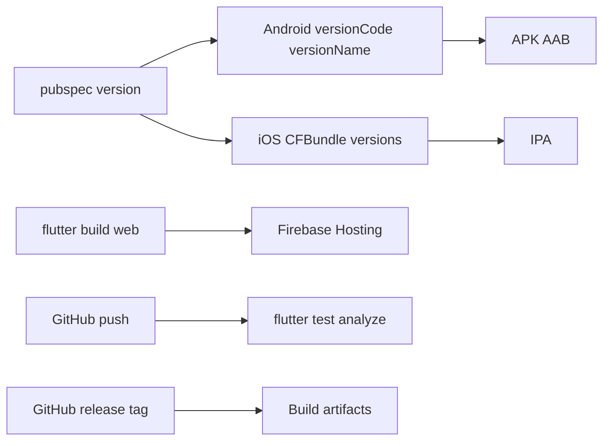

# Piano: Build, deployment e CI/CD (housekeep)

## Contesto repo

- Versione unica in `[pubspec.yaml](d:\source\housekeep\pubspec.yaml)`: `version: 1.0.0+1` (formato Flutter `versionName+versionCode`).
- Android: `[android/app/build.gradle.kts](d:\source\housekeep\android\app\build.gradle.kts)` usa `versionCode` / `versionName` da Flutter e **release firmata con debug** (da sostituire).
- iOS: `[ios/Runner.xcodeproj/project.pbxproj](d:\source\housekeep\ios\Runner.xcodeproj\project.pbxproj)` ha `IPHONEOS_DEPLOYMENT_TARGET = 13.0`; **Podfile assente** nel tree (normale dopo `flutter create` recente o clone parziale) — va rigenerato/committato con `flutter pub get` e primo build iOS o copia dal template Flutter.
- Web: `[web/index.html](d:\source\housekeep\web\index.html)` + `[web/manifest.json](d:\source\housekeep\web\manifest.json)` già presenti; PWA va completata (meta, scope, eventuali shortcut).
- Nessuna workflow GitHub: creare `[.github/workflows/](d:\source\housekeep\.github\workflows)`.




---

## 1. Android

### 1.1 File da toccare

- `[android/settings.gradle.kts](d:\source\housekeep\android\settings.gradle.kts)` — solo se serve aggiornare versioni plugin AGP/Kotlin (oggi AGP 8.9.1, Kotlin 2.1.0); allineare alla [tabella compatibilità Flutter](https://docs.flutter.dev/release/breaking-changes) della tua SDK.
- `[android/app/build.gradle.kts](d:\source\housekeep\android\app\build.gradle.kts)` — `applicationId`, `namespace`, `signingConfigs`, `buildTypes.release`.
- Opzionale: `android/gradle.properties` per `org.gradle.jvmargs`, parallel build.

### 1.2 Versioning

- **Fonte di verità:** `pubspec.yaml` → `version: MAJOR.MINOR.PATCH+BUILD`.
  - `versionName` Android = `MAJOR.MINOR.PATCH` (Flutter espone come `flutter.versionName`).
  - `versionCode` Android = intero `BUILD` (Flutter `flutter.versionCode`).
- Bump manuale o script (vedi sezione 4): incrementare `+BUILD` ad ogni upload Play Store; opzionale bump semantico su `MAJOR.MINOR.PATCH` per release note.

### 1.3 Signing release

1. Generare keystore (locale, una tantum):
  `keytool -genkey -v -keystore upload-keystore.jks -keyalg RSA -keysize 2048 -validity 10000 -alias upload`
2. **Non** committare il `.jks`. Creare `android/key.properties` (gitignored) con:
  - `storePassword`, `keyPassword`, `keyAlias`, `storeFile` (path relativo a `android/`).
3. In `build.gradle.kts`: caricare `key.properties` se esiste; `signingConfigs.create("release") { ... }`; in `buildTypes.release` usare `signingConfig = signingConfigs.getByName("release")` e **rimuovere** l’uso di `debug` per release.

### 1.4 Comandi build esatti

```bash
flutter build apk --release
flutter build appbundle --release
```

Output tipici: `build/app/outputs/flutter-apk/app-release.apk`, `build/app/outputs/bundle/release/app-release.aab`.

Opzionale split ABI: `flutter build apk --release --split-per-abi`.

---

## 2. iOS

### 2.1 Podfile e CocoaPods

- Se manca `ios/Podfile`, eseguire dalla root: `flutter pub get` poi `cd ios && pod install` (Flutter rigenera/crea i file iOS attesi). Committare `Podfile` e `Podfile.lock` quando stabili.

### 2.2 Deployment target

- Allineare **minimum iOS** in `Podfile` (`platform :ios, '13.0'` o superiore se richiesto da plugin) e in Xcode **Runner** → Deployment Target (oggi 13.0 in `project.pbxproj`); Hive/path_provider di solito sono ok su 13+.

### 2.3 Version numbering

- Flutter sincronizza da `pubspec.yaml` in `Info.plist` via build phase; verificare che `CFBundleShortVersionString` / `CFBundleVersion` non siano sovrascritti manualmente in modo incoerente.

### 2.4 Code signing e IPA

- **Locale / Xcode:** aprire `ios/Runner.xcworkspace`, Team, bundle id univoco (sostituire `com.example.housekeep` come su Android).
- **CI:** usare certificati e profili tramite **fastlane match** o secret `APPLE_CERTIFICATE`, `APPLE_PROVISIONING_PROFILE`, variabili `APPLE_ID`, `APP_STORE_CONNECT`_*, oppure **Codemagic / Bitrise** con integrazione Apple.
- Comando build IPA (macOS + Xcode):

```bash
flutter build ipa --release
```

Export in `build/ios/ipa/`. Per export manuale: Archive in Xcode + Organizer.

---

## 3. Web

### 3.1 Build

```bash
flutter build web --release
```

Se l’app è servita in sottocartella su Firebase Hosting:

```bash
flutter build web --release --base-href /nome-cartella/
```

### 3.2 PWA

- `[web/manifest.json](d:\source\housekeep\web\manifest.json)`: aggiornare `name`, `description`, colori brand; aggiungere `scope` coerente con `base-href` (es. `"/"` o `"/housekeep/"`).
- `[web/index.html](d:\source\housekeep\web\index.html)`: meta `theme-color`, descrizione; opzionale `apple-touch-icon` multi-size.
- Flutter genera service worker in build (`flutter_service_worker.js`); per cache policy avanzata documentare che si usa il default Flutter finché non serve custom.

### 3.3 CORS e security headers (hosting)

- **CORS:** rilevante solo se il client chiama API cross-origin; app Flutter web statica su Firebase di solito no. Se in futuro ci sono API: configurare `Access-Control-Allow-Origin` sul backend, non sul solo static hosting.
- **Security headers su Firebase Hosting:** file `firebase.json` nella root repo con `headers` per `*`* o `/`**:
  - `X-Content-Type-Options: nosniff`
  - `X-Frame-Options: DENY` (o SAMEORIGIN se serve embed)
  - `Referrer-Policy: strict-origin-when-cross-origin`
  - Opzionale CSP stringente (più fragile con Flutter web)

---

## 4. Build scripts e version bump

### 4.1 Struttura consigliata

- Cartella `[tool/](d:\source\housekeep\tool)` o `scripts/` (PowerShell su Windows / bash su CI):
  - `bump_version.dart` o `bump_version.ps1`: legge/scrive `pubspec.yaml` (incremento `+build` o patch/minor).
  - `build_android.ps1` / `build_android.sh`: opzionale `flutter clean`, `dart run build_runner build` se serve, poi `flutter build appbundle --release`.
  - `build_ios.sh` (solo macOS): `flutter build ipa --release`.
  - `build_web.sh`: `flutter build web --release` + eventuale `firebase deploy`.

### 4.2 Firebase Hosting (web)

1. `npm i -g firebase-tools` (o `dart pub global activate` non applicabile a firebase CLI).
2. `firebase login:ci` → token per CI.
3. `firebase init hosting` → `public: build/web`, single-page rewrite a `/index.html`.
4. Deploy:

```bash
firebase deploy --only hosting --token "$FIREBASE_TOKEN"
```

---

## 5. CI/CD — GitHub Actions

### 5.1 Workflow `ci.yml` (ogni push / PR)

- Trigger: `push`, `pull_request` su `main` (o `master`).
- Job su `ubuntu-latest`:
  - Checkout, setup Flutter (action tipo `subosito/flutter-action` con channel stable).
  - `flutter pub get`
  - `flutter analyze`
  - `flutter test` (ed eventualmente `integration_test` solo su job separato con emulator, più lento).

### 5.2 Workflow `release.yml` (tag o `workflow_dispatch`)

- **Android:** su `ubuntu-latest`, JDK, Flutter; decode keystore da secret `ANDROID_KEYSTORE_BASE64` in file temporaneo; creare `key.properties` da secrets (`KEYSTORE_PASSWORD`, `KEY_ALIAS`, `KEY_PASSWORD`); `flutter build appbundle --release`; upload artifact `app-release.aab`.
- **iOS:** richiede **macos-latest** + Xcode + secrets Apple (o skip job iOS finché non configurati).
- **Web:** `flutter build web --release`; artifact cartella `build/web`; oppure step `firebase deploy` con `FIREBASE_TOKEN`.

### 5.3 Secrets management (GitHub)


| Secret                                                                   | Uso                                 |
| ------------------------------------------------------------------------ | ----------------------------------- |
| `ANDROID_KEYSTORE_BASE64`                                                | Base64 del `.jks`                   |
| `ANDROID_KEYSTORE_PASSWORD`, `ANDROID_KEY_ALIAS`, `ANDROID_KEY_PASSWORD` | Signing                             |
| `FIREBASE_TOKEN`                                                         | Deploy hosting CI                   |
| `APPLE_`* / certificati codificati                                       | Build IPA su runner macOS           |
| Opzionale `PLAY_SERVICE_ACCOUNT_JSON`                                    | Upload Play da CI (fastlane/supply) |


Mai committare keystore, `key.properties`, certificati o token.

### 5.4 Strategia version bump in CI

- **Opzione A (semplice):** bump manuale su `pubspec.yaml` prima del tag; workflow legge solo la versione.
- **Opzione B:** workflow su tag `v1.2.3` che aggiorna `pubspec` e committa (richiede `contents: write` e attenzione ai loop).
- **Raccomandato per MVP:** A + tag `v1.0.0` allineato a `version` in pubspec.

---

## 6. Checklist integrazione app (Hive / path_provider)

- **Android:** nessun extra obbligatorio per Hive locale.
- **iOS:** verificare permessi se in futuro si aggiungono file picker; attuali dipendenze ok.
- **Web:** Hive usa IndexedDB; testare `flutter run -d chrome` e build release su Firebase URL reale.

---

## 7. Ordine di implementazione suggerito

1. Sostituire `com.example.housekeep` con **application id / bundle id** definitivo (Android + iOS).
2. Configurare keystore + `key.properties` + `build.gradle.kts` release.
3. Ripristinare/committare `ios/Podfile` e verificare `pod install` + build simulator.
4. Raffinare `web/manifest.json` / `index.html` e aggiungere `firebase.json` (headers).
5. Aggiungere script in `tool/` e workflow `ci.yml` + `release.yml` (Android + web prima; iOS quando macOS/secrets pronti).

