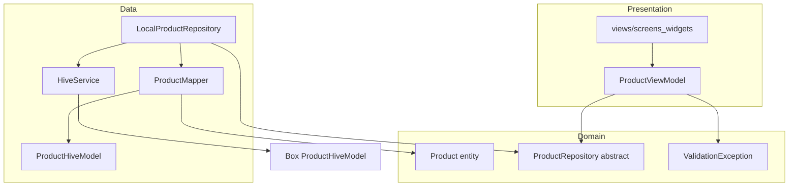

# Piano: Clean Architecture + MVVM + Repository (FASE 1)

Contesto attuale: `[lib/models/product.dart](d:\source\housekeep\lib\models\product.dart)` è sia modello Hive (`@HiveType`) sia usato in UI/VM; `[ProductStorageService](d:\source\housekeep\lib\services\product_storage_service.dart)` incapsula il `Box`. Obiettivo: **dominio senza dipendenze Flutter/Hive**, persistenza e mapping nel **data layer**, stato UI nel **ViewModel** che dipende solo da `**ProductRepository`**.




---

## 1. Struttura file consigliata

```
lib/
  main.dart
  app.dart
  core/
    di/
      app_providers.dart          # MultiProvider + factory composizione
  domain/
    entities/
      product.dart                # Entità pura DateTime + helper
    repositories/
      product_repository.dart     # abstract / interface
    exceptions/
      app_exception.dart          # base opzionale
      product_exception.dart      # errori persistenza / IO
      validation_exception.dart   # regole business / form
  data/
    local/
      hive_service.dart           # init, register adapter, open/close box
      models/
        product_hive_model.dart   # @HiveType typeId 0 (stesso schema attuale)
        product_hive_model.g.dart
      mappers/
        product_mapper.dart       # Product <-> ProductHiveModel
      repositories/
        local_product_repository.dart
  presentation/
    viewmodels/
      product_view_model.dart
    views/
      screens/
      widgets/
  utils/
    date_formatting.dart
    product_validators.dart       # opzionale: spostare sotto domain/validators
```

**Migrazione da layout attuale:** spostare/rinominare `lib/views` → `lib/presentation/views`, `lib/viewmodels` → `lib/presentation/viewmodels`; eliminare `[lib/models/product.dart](d:\source\housekeep\lib\models\product.dart)` e `[product_storage_service.dart](d:\source\housekeep\lib\services\product_storage_service.dart)` dopo aver migrato i riferimenti (o tenere temporaneamente re-export deprecati per ridurre diff in un solo commit).

**Compatibilità dati Hive:** mantenere **stesso `typeId: 0` e stessi `@HiveField` (0–6)** nel nuovo `ProductHiveModel` rispetto al modello attuale, così il box `products` esistente si legge senza migrazione manuale.

---

## 2. `pubspec.yaml` — dipendenze (versioni allineate al progetto)

Nessun pacchetto obbligatorio aggiuntivo rispetto a oggi; opzionale in futuro `equatable` / `freezed` per entità immutabili.

```yaml
environment:
  sdk: ^3.4.0

dependencies:
  flutter:
    sdk: flutter
  flutter_localizations:
    sdk: flutter
  cupertino_icons: ^1.0.8
  provider: ^6.1.2
  hive: ^2.2.3
  hive_flutter: ^1.1.0
  path_provider: ^2.1.4
  path: ^1.9.0
  intl: any                    # vincolare alla versione suggerita da flutter pub get
  uuid: ^4.5.1

dev_dependencies:
  flutter_test:
    sdk: flutter
  flutter_lints: ^5.0.0
  hive_generator: ^2.0.1
  build_runner: ^2.4.13
  mocktail: ^1.0.4
```

Dopo `flutter pub get`, se `intl` entra in conflitto con `flutter_localizations`, usare la versione indicata nel messaggio di errore.

---

## 3. Domain Layer

### 3.1 Entità `Product` (`[lib/domain/entities/product.dart](lib/domain/entities/product.dart)`)

- Campi: `id`, `nome`, `dataAcquisto`, `dataScadenza`, `dataApertura` come `DateTime?`, `quantitaTotale`, `quantitaRimasta` come `int`.
- Preferibile classe **immutabile** (`final` + `copyWith`) per chiarezza; niente `HiveObject`.

**Helper suggeriti (solo dominio, senza `BuildContext`):**

- `bool get isExpired` — se `dataScadenza == null` → `false` (o definire convenzione esplicita nel team); altrimenti confronto a mezzanotte fine giornata o `DateTime.now()` (documentare scelta).
- `int? get daysUntilExpiry` — `null` se non c’è scadenza; altrimenti differenza in giorni tra oggi e scadenza (solo data, timezone locale documentato).
- `bool get isOpened` — `dataApertura != null` (opzionale).
- `bool get isLowStock` — es. `quantitaRimasta <= 1` (soglia configurabile in costante dominio se serve).

Snippet:

```dart
class Product {
  const Product({
    required this.id,
    required this.nome,
    this.dataAcquisto,
    this.dataScadenza,
    this.dataApertura,
    required this.quantitaTotale,
    required this.quantitaRimasta,
  });

  final String id;
  final String nome;
  final DateTime? dataAcquisto;
  final DateTime? dataScadenza;
  final DateTime? dataApertura;
  final int quantitaTotale;
  final int quantitaRimasta;

  bool get isExpired {
    final d = dataScadenza;
    if (d == null) return false;
    final today = DateTime.now();
    final end = DateTime(d.year, d.month, d.day);
    final start = DateTime(today.year, today.month, today.day);
    return end.isBefore(start);
  }

  int? get daysUntilExpiry {
    final d = dataScadenza;
    if (d == null) return null;
    final today = DateTime.now();
    final a = DateTime(today.year, today.month, today.day);
    final b = DateTime(d.year, d.month, d.day);
    return b.difference(a).inDays;
  }

  Product copyWith({ /* ... */ }) { /* ... */ }
}
```

### 3.2 Eccezioni (`[lib/domain/exceptions/](lib/domain/exceptions/)`)

- `AppException` (opzionale): `String message`, `Object? cause`.
- `ProductException extends AppException` — fallimenti lettura/scrittura Hive, box chiuso, ecc.
- `ValidationException extends AppException` — nome vuoto, quantità incoerenti, scadenza prima dell’acquisto (stesse regole di `[product_validators.dart](d:\source\housekeep\lib\utils\product_validators.dart)`, eventualmente spostate nel dominio).

Snippet:

```dart
class ValidationException implements Exception {
  ValidationException(this.message);
  final String message;
  @override
  String toString() => message;
}

class ProductException implements Exception {
  ProductException(this.message, [this.cause]);
  final String message;
  final Object? cause;
}
```

### 3.3 Repository astratto (`[lib/domain/repositories/product_repository.dart](lib/domain/repositories/product_repository.dart)`)

```dart
abstract class ProductRepository {
  Future<List<Product>> getAll();
  Future<Product?> getById(String id);
  Future<void> save(Product product);   // create + update
  Future<void> delete(String id);
}
```

---

## 4. Data Layer

### 4.1 `ProductHiveModel` (`[lib/data/local/models/product_hive_model.dart](lib/data/local/models/product_hive_model.dart)`)

- Copia strutturale del modello Hive attuale (`int?` per date in ms, stessi field index) per **non rompere** storage esistente.
- Nessuna logica di business; opzionale `extends HiveObject` solo se serve `delete()` sul box.

### 4.2 Mapper (`[lib/data/local/mappers/product_mapper.dart](lib/data/local/mappers/product_mapper.dart)`)

```dart
class ProductMapper {
  static Product toDomain(ProductHiveModel m) => Product(
    id: m.id,
    nome: m.nome,
    dataAcquisto: m.dataAcquistoMs == null
        ? null
        : DateTime.fromMillisecondsSinceEpoch(m.dataAcquistoMs!),
    // ...
    quantitaTotale: m.quantitaTotale,
    quantitaRimasta: m.quantitaRimasta,
  );

  static ProductHiveModel toHive(Product p) => ProductHiveModel(
    id: p.id,
    nome: p.nome,
    dataAcquistoMs: p.dataAcquisto?.millisecondsSinceEpoch,
    // ...
  );
}
```

### 4.3 `HiveService` (`[lib/data/local/hive_service.dart](lib/data/local/hive_service.dart)`)

Responsabilità: `WidgetsFlutterBinding.ensureInitialized()` lasciato in `main`; il servizio espone:

- `Future<void> init()` — `Hive.initFlutter()`, `registerAdapter(ProductHiveModelAdapter())` se non registrato.
- `Future<Box<ProductHiveModel>> openProductsBox()` — `openBox<ProductHiveModel>('products')` (stesso nome box attuale).
- Opzionale: `Future<void> dispose()` — chiusura box / `Hive.close()` in test.

Gestione errori: wrappare in `ProductException` con messaggio user-neutral + log `debugPrint` in debug.

### 4.4 `LocalProductRepository` (`[lib/data/repositories/local_product_repository.dart](lib/data/repositories/local_product_repository.dart)`)

- Dipende da `Box<ProductHiveModel>` (iniettato dal factory dopo `openProductsBox`).
- `getAll`: `box.values.map(ProductMapper.toDomain).toList()`.
- `save`: `await box.put(entity.id, ProductMapper.toHive(entity))`.
- `delete`: `await box.delete(id)`.
- Cattura `HiveError` / eccezioni e rilancia `ProductException`.

### 4.5 Factory (`[lib/core/di/app_providers.dart](lib/core/di/app_providers.dart)` o `dependency_injection.dart`)

```dart
class AppFactory {
  static Future<AppDependencies> create() async {
    final hive = HiveService();
    await hive.init();
    final box = await hive.openProductsBox();
    final repo = LocalProductRepository(box);
    return AppDependencies(
      hiveService: hive,
      productRepository: repo,
    );
  }
}

class AppDependencies {
  AppDependencies({
    required this.hiveService,
    required this.productRepository,
  });
  final HiveService hiveService;
  final ProductRepository productRepository;
}
```

`main.dart`: `final deps = await AppFactory.create(); runApp(HousekeepApp(deps: deps));`

---

## 5. ViewModel Layer (`[lib/presentation/viewmodels/product_view_model.dart](lib/presentation/viewmodels/product_view_model.dart)`)

- `extends ChangeNotifier`, dipende da `ProductRepository` (non da `HiveService` né da `Box`).
- Stato: `_products`, `isLoading`, `errorMessage` (o sealed/async state minimale: idle/loading/success/error).
- Metodi richiesti:
  - `Future<void> loadProducts()` — try/catch: `ProductException` → messaggio amichevole; `ValidationException` se usata anche da qui.
  - `Future<void> createProduct(Product p)` / `updateProduct` — validare **prima** (stesso `[ProductValidators](d:\source\housekeep\lib\utils\product_validators.dart)` adattato a `domain.Product`) e lanciare o mappare `ValidationException` → messaggio UI.
  - `Future<void> deleteProduct(String id)`.
- Messaggi: mappa centralizzata (es. `String _mapError(Object e)`) per non duplicare stringhe nelle view.

Snippet struttura:

```dart
class ProductViewModel extends ChangeNotifier {
  ProductViewModel(this._repository);
  final ProductRepository _repository;

  Future<void> loadProducts() async {
    _setLoading(true);
    try {
      final list = await _repository.getAll();
      list.sort((a, b) => a.nome.toLowerCase().compareTo(b.nome.toLowerCase()));
      _products = list;
      _errorMessage = null;
    } on ProductException catch (e) {
      _errorMessage = e.message;
      _products = [];
    } catch (e, st) {
      debugPrint('$e\n$st');
      _errorMessage = 'Qualcosa è andato storto. Riprova.';
    } finally {
      _setLoading(false);
    }
  }
}
```

**Nota:** `getAll` nel repository come `Future` allinea il contratto anche se Hive è spesso sincrono internamente (implementazione `async` + `await` sul `put`/`delete`).

---

## 6. Dependency Injection (Provider)

In `[lib/app.dart](d:\source\housekeep\lib\app.dart)` (o `[app_providers.dart](lib/core/di/app_providers.dart)`):

```dart
MultiProvider(
  providers: [
    Provider<HiveService>.value(value: deps.hiveService),
    Provider<ProductRepository>.value(value: deps.productRepository),
    ChangeNotifierProvider<ProductViewModel>(
      create: (ctx) => ProductViewModel(ctx.read<ProductRepository>())..loadProducts(),
    ),
  ],
  child: MaterialApp(/* ... */),
)
```

Attenzione: `..loadProducts()` nel `create` può essere pesante; preferibile come oggi `**addPostFrameCallback` dalla lista** per evitare doppie chiamate e problemi di contesto.

Accesso app-wide: `context.read<ProductViewModel>()` / `watch` nelle screen; test con `Provider<ProductRepository>` mock.

---

## 7. Aggiornamento UI

- `[product_list_screen.dart](d:\source\housekeep\lib\views\screens\product_list_screen.dart)`, `[product_form_screen.dart](d:\source\housekeep\lib\views\screens\product_form_screen.dart)`, `[product_card.dart](d:\source\housekeep\lib\views\widgets\product_card.dart)`: import di `domain/entities/product.dart`; campi date già `DateTime?`.
- Opzionale in card: badge “Scaduto” / “Tra X giorni” usando `product.isExpired` e `product.daysUntilExpiry`.

---

## 8. Testing strategy


| Livello      | Cosa testare                                      | Come                                                                                                                                                                     |
| ------------ | ------------------------------------------------- | ------------------------------------------------------------------------------------------------------------------------------------------------------------------------ |
| Domain       | Helper `isExpired`, `daysUntilExpiry`, `copyWith` | `test/domain/product_test.dart` — puro Dart                                                                                                                              |
| Domain       | Validatori (se spostati)                          | `test/domain/product_validators_test.dart`                                                                                                                               |
| Data         | Mapper round-trip                                 | `test/data/product_mapper_test.dart`                                                                                                                                     |
| Data         | `LocalProductRepository` CRUD                     | `Hive.init` su `Directory.systemTemp`, box nome univoco, come `[product_storage_service_test.dart](d:\source\housekeep\test\services\product_storage_service_test.dart)` |
| Presentation | `ProductViewModel`                                | `MockProductRepository` con `mocktail`, verifica ordinamento, error mapping                                                                                              |
| Widget       | Lista / form                                      | Mock `ProductRepository`, evitare `pumpAndSettle` infinito con `CircularProgressIndicator` (pump a tempo fisso come già fatto nei test esistenti)                        |


---

## 9. Ordine di implementazione consigliato

1. Aggiungere `domain/entities/product.dart` + eccezioni + `ProductRepository`.
2. Introdurre `ProductHiveModel` + mapper + `build_runner` (verificare typeId/field id).
3. Implementare `HiveService` + `LocalProductRepository`; test CRUD.
4. Refactor `ProductViewModel` su repository; aggiornare `app.dart` / `main` con `AppFactory`.
5. Aggiornare views e rimuovere `ProductStorageService` / vecchio `models/product.dart`.
6. Eseguire `flutter test` e `flutter analyze`; smoke su web/Android.

Questo piano mantiene MVVM + Provider, aggiunge Repository e separazione clean senza backend, ed è pronto per FASE 2 (location) con nuovi repository/entità nello stesso schema.