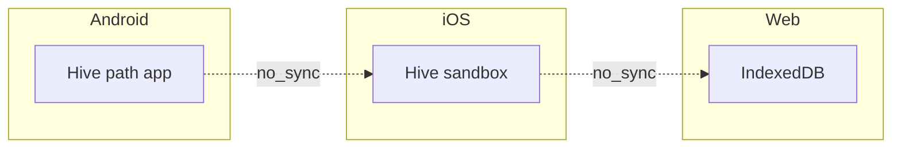

# Validazione end-to-end e checklist pre-release (Housekeep)

## Premessa sui dati cross-platform

Hive su **Android / iOS / Web** usa storage **isolato per installazione e piattaforma**. Non esiste oggi sync cloud: i “stessi dati” su tre piattaforme vanno **ricreati manualmente**, **importati** (se/quando disponibile), oppure generati con uno **script di seed** ripetibile. La validazione cross-platform confronta **comportamento e UI**, non l’uguaglianza byte-per-byte del database.

---

## 1. Scenario test completo (manuale o semi-automatizzato)

### 1.1 Struttura luoghi (seed consigliato)

Creare almeno questa gerarchia per coprire più stanze e più posizioni per stanza:

| Luogo   | Posizioni                    |
| ------- | ---------------------------- |
| Cucina  | Frigo, Dispensa, Congelatore |
| Bagno   | Armadietto, Ripiano          |
| Cantina | Scaffale                     |

Verifica in app: tab **Luoghi** (`[home_shell_screen.dart](d:\source\housekeep\lib\presentation\views\screens\home_shell_screen.dart)`) — espansione gerarchia, modifica nome, navigazione verso inventario filtrato se previsto dalla UI.

### 1.2 50 prodotti vari

Distribuzione suggerita (numeri indicativi):

- ~20 con `positionId` su Cucina (mix Frigo/Dispensa).
- ~15 su Bagno.
- ~10 Cantina o senza posizione.
- ~5 con **solo data scadenza** (vedi sotto edge date).
- Nomi duplicati intenzionali (stesso nome, luoghi diversi) per verifica liste e ordinamento (`[ProductViewModel.loadProducts](d:\source\housekeep\lib\presentation\viewmodels\product_view_model.dart)` ordina per nome).

Quantità: mix di `quantitaTotale` / `quantitaRimasta` (inclusi casi limite 0 se consentiti dai validatori).

### 1.3 Associazione Location/Position

Per ogni prodotto con posizione: verificare che in **modulo prodotto** la posizione selezionata corrisponda a **Riepilogo** (tab che usa `[LocationInventoryViewModel](d:\source\housekeep\lib\presentation\viewmodels\location_inventory_view_model.dart)`) — stesso prodotto sotto la posizione attesa.

### 1.4 Persistenza cold start

Su **ogni piattaforma** sotto test:

1. Chiudere l’app (force stop su mobile; tab chiuso su web o refresh dopo deploy locale).
2. Riaprire e verificare: conteggio prodotti, filtro luogo, Riepilogo, dettaglio prodotto.

**Web:** ricordare che svuotare dati del sito / cache può cancellare IndexedDB — documentare se il test include “refresh normale” vs “clear site data”.

---

## 2. Cross-platform validation

### 2.1 Coerenza funzionale (non identità dati)

Per Android, iOS (simulatore/device) e Chrome:

| Area        | Cosa verificare                                                                                                                                              |
| ----------- | ------------------------------------------------------------------------------------------------------------------------------------------------------------ |
| Navigazione | Stessi tre tab; su larghezza ampia `[NavigationRail](d:\source\housekeep\lib\presentation\views\screens\home_shell_screen.dart)`, su stretta `NavigationBar` |
| CRUD        | Creazione luogo/posizione/prodotto, modifica, eliminazione con messaggi coerenti                                                                             |
| Filtri      | Filtro per luogo su Inventario allineato a posizioni                                                                                                         |
| Errori      | Stessi testi (locale `it_IT` in `[app.dart](d:\source\housekeep\lib\app.dart)`)                                                                              |

### 2.2 UI consistency

- Overflow testo (nomi lunghi, note).
- Tastiera su mobile: form prodotto non copre CTA critiche.
- Web: scroll mouse vs touch; focus campi.

### 2.3 Performance (confronto qualitativo)

- Scroll lista inventario con 50 e poi **1000+** prodotti (seed o script): jank percettibile, tempo apertura tab.
- Confronto **relativo** tra piattaforme (stesso scenario seed), senza obiettivo ms fissi in MVP — registrare note in checklist.

---

## 3. Edge cases (comportamento atteso dal codice)

| Caso                                | Comportamento atteso                                                                                                                                                                                                                                                                                                      | Dove verificare                                                                                    |
| ----------------------------------- | ------------------------------------------------------------------------------------------------------------------------------------------------------------------------------------------------------------------------------------------------------------------------------------------------------------------------- | -------------------------------------------------------------------------------------------------- |
| **Eliminazione luogo con prodotti** | I prodotti **non** sono eliminati; perdono il link (`clearPositionIdsForPositions` + rimozione posizioni) — allineato a `[LocalLocationRepository.deleteLocation](d:\source\housekeep\lib\data\local\repositories\local_location_repository.dart)` e [ADR 0004](d:\source\housekeep\docs\adr\0004-product-position-fk.md) | Dopo delete: prodotti ancora in Inventario, `positionId` null                                      |
| **Eliminazione prodotto**           | Rimozione record prodotto; **nessun** aggiornamento automatico alle posizioni (le posizioni non “contano” prodotti)                                                                                                                                                                                                       | Lista posizioni invariata                                                                          |
| **Eliminazione posizione**          | `positionId` azzerato sui prodotti che la usavano                                                                                                                                                                                                                                                                         | `[deletePosition](d:\source\housekeep\lib\data\local\repositories\local_location_repository.dart)` |
| **Dataset grande (1000+)**          | Scroll, `loadProducts` + sort, memoria                                                                                                                                                                                                                                                                                    | DevTools Performance/Memory se necessario                                                          |
| **Date estreme**                    | `[Product.isExpired](d:\source\housekeep\lib\domain\entities\product.dart)` confronta solo date locali; passato remoto / futuro lontano: verifica badge UI e validatori form                                                                                                                                              | Form + lista                                                                                       |

---

## 4. User experience flow

### 4.1 First-time / onboarding

Oggi **non** risulta implementato onboarding (`SharedPreferences` / tutorial) nel flusso `[main` → `HousekeepApp](d:\source\housekeep\lib\app.dart)`. Checklist:

- Schermata iniziale comprensibile senza guida (etichette tab chiare).
- (Futuro) Allineare eventuale onboarding a `[docs/user/overview.md](d:\source\housekeep\docs\user\overview.md)`.

### 4.2 Navigazione

- Passaggio Inventario → dettaglio → modifica → indietro senza perdita stato tab.
- Luoghi: creazione gerarchia senza dead-end.

### 4.3 Messaggi errore

- Errori da `ProductException` / `LocationException` e fallback generici in ViewModel — verificare che siano **azioni** (riprova) o **chiari** (validazione).

---

## 5. Checklist pre-release (sintesi operativa)

### Dati e persistenza

- Scenario luoghi + 50 prodotti eseguito su almeno una piattaforma primaria.
- Cold start dopo kill app: dati intatti.
- Edge delete luogo / posizione / prodotto documentati sopra verificati.

### Cross-platform

- Android build release o debug su device.
- iOS simulatore o device (se Apple ID / signing disponibili).
- Web `flutter run -d chrome` + build `flutter build web --release` su URL reale o `firebase serve` se in uso.

### Qualità

- `flutter analyze` pulito.
- `flutter test` verde.
- Nessun crash bloccante nei flussi CRUD principali.

### UX e accessibilità (minimo)

- Testo leggibile (tema chiaro/scuro se applicabile).
- Target touch >= 48 dp dove rilevante.

### Performance (smoke)

- Lista 1000+ prodotti: accettabile per rilascio o aperta issue/documentazione nota.

### Documentazione release

- Versione `pubspec.yaml` coerente con tag / note rilascio.
- Link a `[docs/developer/build.md](d:\source\housekeep\docs\developer\build.md)` per firma e CI.

---

## 6. Automazione opzionale (post-checklist manuale)

- Estendere `[integration_test/](d:\source\housekeep\integration_test)` con flusso: apri app → crea un luogo → una posizione → un prodotto → assert lista.
- Script in `tool/` per generare N prodotti Hive (solo dev) per test performance ripetibili.

