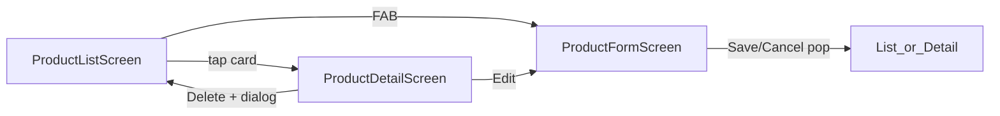

# Piano UI FASE 1 — Material 3, responsive, dark/light

**Stato attuale:** esistono già `[ProductListScreen](d:\source\housekeep\lib\presentation\views\screens\product_list_screen.dart)`, `[ProductFormScreen](d:\source\housekeep\lib\presentation\views\screens\product_form_screen.dart)`, `[ProductCard](d:\source\housekeep\lib\presentation\views\widgets\product_card.dart)`, `[DateFormField](d:\source\housekeep\lib\presentation\views\widgets\date_field.dart)`, tema chiaro/scuro in `[lib/app.dart](d:\source\housekeep\lib\app.dart)`. Il dominio `[Product](d:\source\housekeep\lib\domain\entities\product.dart)` espone `isExpired`, `daysUntilExpiry`, quantità.

**Nota su “quantità opzionali”:** oggi i validatori richiedono `quantitaTotale >= 1`. Per UX “campo vuoto” si può: (A) mostrare placeholder e inviare default `1` al salvataggio, oppure (B) allentare le regole nel dominio/validatori. Il piano assume **(A)** per non rompere il repository senza migrazione.

---

## 1. Tema e color scheme (Material 3)

**File principale:** estrarre tema in `[lib/core/theme/app_theme.dart](lib/core/theme/app_theme.dart)` (o `presentation/theme/`) e importarlo da `[app.dart](d:\source\housekeep\lib\app.dart)`.

- `ThemeData` con `useMaterial3: true`, `ColorScheme.fromSeed` per light/dark (seed verde inventario coerente con oggi).
- Aggiungere `**ColorScheme` custom extensions** o classe statica `AppExpiryColors` (non su `ThemeExtension` obbligatorio in FASE 1) con tre livelli, derivati da `colorScheme` per accessibilità in dark mode:
  - **Scaduto:** `error` / `errorContainer`
  - **Urgente (0–7 giorni, non scaduto):** `tertiary` arancio — usare seed arancio secondario o `ColorScheme.fromSeed` con `dynamicSchemeVariant` / colore fisso documentato (es. `Color(0xFFE65100)` in light, tono più chiaro in dark tramite `ColorScheme` mix).
  - **OK:** `primary` / `surfaceContainerHighest` per bordo sottile o `outlineVariant`.

Snippet configurazione tema:

```dart
ThemeData buildLightTheme() {
  final scheme = ColorScheme.fromSeed(
    seedColor: const Color(0xFF2E7D32),
    brightness: Brightness.light,
  );
  return ThemeData(
    useMaterial3: true,
    colorScheme: scheme,
    appBarTheme: AppBarTheme(centerTitle: false, elevation: 0),
    cardTheme: CardThemeData(elevation: 1, clipBehavior: Clip.antiAlias),
  );
}
```

Ripetere per `darkTheme` con seed più chiaro (come oggi) o `brightness: Brightness.dark`.

---

## 2. Logica urgenza (presentation-only)

**File:** `[lib/presentation/theme/product_expiry_status.dart](lib/presentation/theme/product_expiry_status.dart)`

Enum `ExpiryUrgency { expired, urgent, ok, unknown }` + funzione `ExpiryUrgency urgencyOf(Product p)`:

- `unknown` se `dataScadenza == null`
- `expired` se `p.isExpired`
- `urgent` se `daysUntilExpiry != null && daysUntilExpiry >= 0 && daysUntilExpiry <= 7`
- altrimenti `ok`

Usata da `StatusBadge`, bordo/colore `ProductCard`, e dettaglio.

---

## 3. Navigazione




- **Lista:** tap → `Navigator.push` verso **dettaglio** (non più direttamente al form).
- **FAB:** `ProductFormScreen(product: null)`.
- **Dettaglio:** `ProductFormScreen(product: p)`; dopo save `pop` fino a lista o `pop` singolo + refresh VM (già su `loadProducts` al ritorno se si fa `pop` dalla lista — valutare `await push` nella lista e `vm.loadProducts()` in `then`).

**Route names:** opzionale in FASE 1 usare solo `MaterialPageRoute`; per “design future search” conviene introdurre `onGenerateRoute` o `go_router` in FASE 2+; per ora costanti `AppRoutes.list`, `AppRoutes.detail`, `AppRoutes.form` in `[lib/core/navigation/app_routes.dart](lib/core/navigation/app_routes.dart)`.

---

## 4. Screen — struttura e snippet

### 4.1 `ProductListScreen` (evoluzione)

**Widget tree (concettuale):**

```
Scaffold
├── AppBar (title, refresh, [future: SearchAnchor placeholder])
├── body: LayoutBuilder / ResponsiveBuilder
│   ├── narrow: ListView + Dismissible
│   └── wide: Row [ ListView | detail placeholder o ProductDetailScreen embedded ]
└── FAB
```

- **Lista:** `ListView.builder` → `Dismissible` (direction `endToStart`) con sfondo rosso + icona delete; `confirmDismiss` → stesso dialog di conferma già usato; su dismiss completo chiamare `deleteProduct`.
- **Card:** `ProductCard` con `urgency` visiva (bordo sinistro `Container` 4px colorato o `Card` + `shape` con side).
- **Contenuto card:** nome, riga secondaria `formatDate(scadenza)`, testo “Tra N giorni” / “Scaduto” / “Nessuna scadenza”, quantità `rimasta / totale`.
- **Search (design future):** `AppBar` con `SearchAnchor`/`SearchBar` disabilitato o `onTap: () {}` + `Tooltip` “Prossimamente”, oppure stato locale `filter` già cablato su `vm.products.where(...)` se si vuole filtro minimo per nome (optional).

### 4.2 `ProductFormScreen` (evoluzione)

**Widget tree:**

```
Scaffold
├── AppBar (Save icon optional)
└── body: Center → ConstrainedBox(maxWidth: 800) → SingleChildScrollView
    └── Form
        ├── ValidationErrorWidget (riassunto errori da ValueNotifier o FormState)
        ├── TextFormField nome
        ├── DatePickerField × 3
        ├── Row: QuantityField totale | QuantityField rimasta
        └── Row: FilledButton Save | TextButton Cancel
```

- Sostituire i due `TextFormField` quantità con `**QuantityField**` (vedi sez. 5).
- **Real-time:** `autovalidateMode: AutovalidateMode.onUserInteraction` sul `Form`; per quantità sincronizzare validatori incrociati (rimasta vs totale) con `onChanged` che chiama `formKey.currentState?.validate()` sul campo gemello (pattern leggero).
- **Cancel:** `Navigator.maybePop`.
- **Delete:** il piano chiede conferma eliminazione nel form — mostrare `TextButton`/`IconButton` “Elimina” in `AppBar` solo se `product != null`, con dialog e `vm.deleteProduct`.

### 4.3 `ProductDetailScreen` (nuovo)

**File:** `[lib/presentation/views/screens/product_detail_screen.dart](lib/presentation/views/screens/product_detail_screen.dart)`

**Widget tree:**

```
Scaffold
├── AppBar (actions: IconButton edit, IconButton delete)
└── body: SingleChildScrollView / ConstrainedBox(maxWidth: 600)
    └── Column
        ├── Text nome (headline)
        ├── StatusBadge (grande)
        ├── ListTile / righe: acquisto, scadenza, apertura
        ├── Text calcoli: giorni alla scadenza, stato scaduto
        ├── Text “Uso consigliato” (euristica FASE 1: es. se scaduto “Non consumare”; se urgente “Consumare presto”; se aperto da X giorni testo generico)
        └── Chip quantità
```

**Dati:** riceve `Product product` (snapshot); dopo edit dalla stessa sessione si può `pop` con risultato o ricaricare da `vm.getById` se aggiungi metodo al VM (opzionale: `Product? findById` dalla lista in memoria).

---

## 5. Widget riusabili


| Widget                  | File suggerito                                                                                                                         | Ruolo                                                                                                                       |
| ----------------------- | -------------------------------------------------------------------------------------------------------------------------------------- | --------------------------------------------------------------------------------------------------------------------------- |
| `StatusBadge`           | `presentation/views/widgets/status_badge.dart`                                                                                         | Chip/`DecoratedBox` con colore da `ExpiryUrgency` + label localizzata                                                       |
| `DatePickerField`       | Rinominare/refactor `[date_field.dart](d:\source\housekeep\lib\presentation\views\widgets\date_field.dart)` → `date_picker_field.dart` | API chiara: `label`, `value`, `onChanged`, `firstDate`, `lastDate`                                                          |
| `QuantityField`         | `presentation/views/widgets/quantity_field.dart`                                                                                       | `Row` con `IconButton` `-`, `TextFormField` centrato (readOnly + controller), `IconButton` +; clamp `0..totale` per rimasta |
| `ValidationErrorWidget` | `presentation/views/widgets/validation_error_widget.dart`                                                                              | Mostra `List<String>` errori o singolo messaggio sotto AppBar (M3 `MaterialBanner` opzionale)                               |
| `ProductCard`           | Refactor `[product_card.dart](d:\source\housekeep\lib\presentation\views\widgets\product_card.dart)`                                   | Usa `StatusBadge`, bordo urgenza, layout righe richiesto                                                                    |


**Snippet `StatusBadge`:**

```dart
Widget build(BuildContext context) {
  final scheme = Theme.of(context).colorScheme;
  final (bg, fg, label) = switch (urgency) {
    ExpiryUrgency.expired => (scheme.errorContainer, scheme.onErrorContainer, 'Scaduto'),
    ExpiryUrgency.urgent => (scheme.tertiaryContainer, scheme.onTertiaryContainer, 'Urgente'),
    ...
  };
  return Chip(label: Text(label), backgroundColor: bg, labelStyle: TextStyle(color: fg));
}
```

---

## 6. Responsive design

**Breakpoint helper:** `[lib/presentation/layout/breakpoints.dart](lib/presentation/layout/breakpoints.dart)`

```dart
bool isWideWidth(double w) => w >= 840; // Material guideline “expanded”
bool isMedium(double w) => w >= 600;
```

- **Web / desktop:** `ProductFormScreen` e `ProductDetailScreen` avvolti in `Center` + `ConstrainedBox(maxWidth: 800)` (form) / `600` (dettaglio).
- **Tablet wide (`>= 840`):** `ProductListScreen` usa `Row`:
  - `Expanded(flex: 2)` lista con `Dismissible` + card
  - `VerticalDivider`
  - `Expanded(flex: 3)` pannello dettaglio: se `selectedProduct != null` mostra `ProductDetailView` (widget senza Scaffold) altrimenti placeholder “Seleziona un prodotto”
- **Mobile:** stack navigazione classica Lista → Dettaglio → Form (nessun split).

**Ottimizzazione cross-platform:** evitare `pumpAndSettle` infinito nei test quando c’è `CircularProgressIndicator`; su web ridurre animazioni non necessarie (default M3 ok).

---

## 7. Widget tree globale (app)

```
MaterialApp
└── MultiProvider
    └── ProductListScreen (home)
        └── [push] ProductDetailScreen
            └── [push] ProductFormScreen
```

Con two-pane: home `Row` con dettaglio incorporato; navigazione form resta push modale o fullscreen dialog su tablet (preferenza: `fullscreenDialog: true` su mobile, finestra laterale opzionale FASE 2).

---

## 8. Testing UI (incrementale)

- **Widget:** `StatusBadge` render per ogni `ExpiryUrgency`.
- **Widget:** `QuantityField` increment/decrement aggiorna controller.
- **Golden (opzionale):** solo se il team li usa; altrimenti skip.
- Aggiornare test lista esistenti: mock navigazione verso dettaglio se si aggiungono `Key` su card (`Key(ValueKey(p.id))`).

---

## 9. Ordine di implementazione consigliato

1. `AppTheme` + eventuale `AppExpiryColors` / enum urgenza.
2. `StatusBadge` + refactor `ProductCard` (color coding + contenuto richiesto).
3. `ProductDetailScreen` + `ProductDetailBody` (widget riusabile per split view).
4. `ProductListScreen`: swipe delete, tap → dettaglio, layout wide.
5. `DatePickerField` (rename/cleanup), `QuantityField`, `ValidationErrorWidget`.
6. `ProductFormScreen`: constrained width, quantity fields, delete in edit, autovalidate.
7. `flutter analyze` / `flutter test` / smoke manuale web + mobile.

Questo piano rispetta MVVM esistente: nessuna logica business nuova nel dominio salvo eventuale testo “uso consigliato” calcolato in presentation o piccolo helper statico su `Product`.