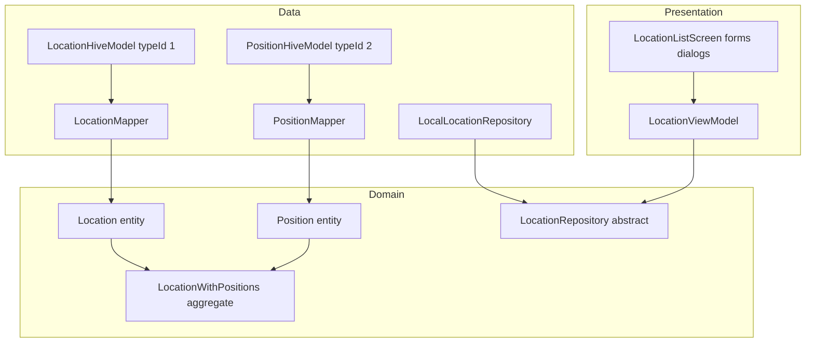

# Piano FASE 2: Location Management (Hive + MVVM)

## Contesto attuale

- DI: `[AppDependencies](d:\source\housekeep\lib\core\di\app_providers.dart)` + `[HousekeepApp](d:\source\housekeep\lib\app.dart)` espongono `HiveService`, `ProductRepository`, `ProductViewModel`.
- Hive: `[ProductHiveModel](d:\source\housekeep\lib\data\local\models\product_hive_model.dart)` usa `**typeId: 0**` e box `**products**` — **non modificare** campi/typeId per compatibilità dati FASE 1.
- Pattern da replicare: entità pure in `lib/domain/`, DTO `@HiveType` + mapper in `lib/data/local/`, repository concreto, eccezioni `ProductException` (o analoghe `LocationException` se si preferisce separare messaggi).




---

## 1. Domain layer

### 1.1 Modelli

- `**Location**` (`[lib/domain/entities/location.dart](lib/domain/entities/location.dart)`): `id`, `nome`, `descrizione` (`String?`).
- `**Position**` (`[lib/domain/entities/storage_position.dart](lib/domain/entities/storage_position.dart)` o `position.dart` per evitare clash con `flutter/material.dart`): `id`, `nome`, `descrizione` (`String?`), `**locationId**` (FK verso `Location.id`).

**Nota su `posizioni[]` sulla Location:** in dominio è utile un **aggregate** solo in memoria (non serializzato così in Hive):

- `**LocationWithPositions`**: `Location location` + `List<Position> positions` (ordinate es. per `nome`), costruito dal repository dopo lettura da due sorgenti.

Relazione logica: **1 Location → N Position**; integrità: ogni `Position.locationId` deve esistere; eliminazione location = **cascade delete** delle position (o blocco con errore — raccomandato **cascade** per UX semplice).

### 1.2 Repository astratto

`[lib/domain/repositories/location_repository.dart](lib/domain/repositories/location_repository.dart)`:

- `Future<List<LocationWithPositions>> getAllWithPositions()` (o `getHierarchy()`).
- `Future<Location?> getLocationById(String id)`.
- `Future<void> saveLocation(Location location)` (create/update per `id`).
- `Future<void> deleteLocation(String id)` (cascade positions).
- `Future<void> savePosition(Position position)`.
- `Future<void> deletePosition(String id)`.
- Opzionale: `Future<LocationWithPositions?> getLocationWithPositions(String locationId)` per dettaglio.

Validazione (nome obbligatorio, lunghezze): `[lib/utils/location_validators.dart](lib/utils/location_validators.dart)` o `domain/validators` allineato a `[product_validators.dart](d:\source\housekeep\lib\utils\product_validators.dart)`.

---

## 2. Data layer — struttura Hive

### 2.1 Adapter e typeId


| Modello Hive                   | typeId | Box name    | Chiave        |
| ------------------------------ | ------ | ----------- | ------------- |
| `ProductHiveModel` (esistente) | **0**  | `products`  | `product.id`  |
| `LocationHiveModel`            | **1**  | `locations` | `location.id` |
| `PositionHiveModel`            | **2**  | `positions` | `position.id` |


**Perché due box:** relazione parent-child tramite `**locationId`** su `PositionHiveModel`; niente lista annidata nel documento Location (evita duplicazione e migra bene verso FASE 3).

### 2.2 DTO Hive (snippet concettuale)

`LocationHiveModel`: campi `@HiveField` 0..2 — `id`, `nome`, `descrizione` (nullable string).

`PositionHiveModel`: `id`, `nome`, `descrizione`, `locationId`.

Dopo `build_runner`: `*.g.dart` registrati in `[HiveService.init](d:\source\housekeep\lib\data\local\hive_service.dart)` **solo se non già registrati** (controllare `isAdapterRegistered(1)` e `(2)` oltre a `0`).

### 2.3 HiveService

Estendere `[HiveService](d:\source\housekeep\lib\data\local\hive_service.dart)`:

- `openLocationsBox()` → `Box<LocationHiveModel>`
- `openPositionsBox()` → `Box<PositionHiveModel>`
- Costanti `kLocationsBoxName`, `kPositionsBoxName`.

`[AppFactory.create](d:\source\housekeep\lib\core\di\app_providers.dart)`: dopo `openProductsBox()`, aprire i due nuovi box e costruire `LocalLocationRepository(locationsBox, positionsBox)`.

### 2.4 LocalLocationRepository — gerarchia in persistenza

`[lib/data/local/repositories/local_location_repository.dart](lib/data/local/repositories/local_location_repository.dart)`:

1. `**getAllWithPositions`**: leggi tutte le locations; leggi tutte le positions; raggruppa in `Map<locationId, List<Position>>`; costruisci `List<LocationWithPositions>`.
2. `**saveLocation`**: `put(location.id, mapper.toHive(location))`.
3. `**deleteLocation(id)**`: `positionsBox.values.where((p) => p.locationId == id)` → delete each key; poi `locationsBox.delete(id)`.
4. `**savePosition**`: se `locationId` non esiste → `ProductException` / `LocationException` con messaggio IT.
5. `**deletePosition(id)**`: `positionsBox.delete(id)`.

Mapper dedicati: `[location_mapper.dart](lib/data/local/mappers/location_mapper.dart)`, `[position_mapper.dart](lib/data/local/mappers/position_mapper.dart)` (simmetrici a `[product_mapper.dart](d:\source\housekeep\lib\data\local\mappers\product_mapper.dart)`).

**Snippet logica raggruppamento (Dart):**

```dart
final byLocation = <String, List<Position>>{};
for (final p in allPositions) {
  (byLocation[p.locationId] ??= []).add(PositionMapper.toDomain(p));
}
return allLocations.map((loc) {
  final id = loc.id;
  final children = List<Position>.from(byLocation[id] ?? const [])
    ..sort((a, b) => a.nome.toLowerCase().compareTo(b.nome.toLowerCase()));
  return LocationWithPositions(
    location: LocationMapper.toDomain(loc),
    positions: children,
  );
}).toList()
  ..sort((a, b) => a.location.nome.toLowerCase().compareTo(b.location.nome.toLowerCase()));
```

---

## 3. ViewModel layer

Per evitare **doppia fonte di verità** tra due `ChangeNotifier`, il piano raccomanda:

- `**LocationViewModel`** (unico notifier per albero): stato `_items: List<LocationWithPositions>`, `isLoading`, `errorMessage`; metodi:
  - `loadHierarchy()` (alias di ciò che l’utente chiama `getLocationWithPositions()` a livello UI: ricarica tutto o filtra per id in memoria).
  - CRUD location: `createLocation`, `updateLocation`, `deleteLocation` → poi `loadHierarchy()`.
  - CRUD position: `addPosition(locationId, ...)`, `updatePosition`, `deletePosition(String id)` → poi `loadHierarchy()`.

**Se si vogliono due classi per chiarezza (come richiesto):**

- `PositionViewModel` **delega** allo stesso `LocationRepository` e chiama `onChanged` / `context.read<LocationViewModel>().loadHierarchy()` dopo ogni mutazione (accoppiamento stretto), oppure entrambi osservano un `**HierarchyController`** minimo — valutare costo/beneficio; per FASE 2 **un solo ViewModel** è sufficiente e copre i metodi richiesti.

---

## 4. UI layer

### 4.1 Navigazione e entry point

- Estendere `[AppRoutes](d:\source\housekeep\lib\core\navigation\app_routes.dart)` con `locations`.
- `**Home`**: `Scaffold` con `**NavigationBar`** o `**NavigationRail**` (responsive: rail se `isWideWidth` da `[breakpoints.dart](d:\source\housekeep\lib\presentation\layout\breakpoints.dart)`) con due voci: **Inventario** ( `[ProductListScreen](d:\source\housekeep\lib\presentation\views\screens\product_list_screen.dart)` ) e **Luoghi** (`LocationListScreen`). Body: `IndexedStack` o `Navigator` nested — preferenza **IndexedStack** per mantenere stato lista prodotti.

### 4.2 LocationListScreen (tree / accordion)

- `**ListView`** di `**ExpansionTile`** (Material 3 nativo, accessibile):
  - **Leading**: icona `place_outlined` / `kitchen` a scelta.
  - **Title**: nome location; **subtitle**: descrizione troncata.
  - **Children**: `ListTile` per ogni Position (nome, subtitle descrizione); trailing `IconButton` edit/delete.
  - **Trailing** sulla tile location: menu o icon edit/delete location.
- **FAB** o **AppBar** `+`: apre `AddLocationForm` (route/dialog full screen su mobile).
- Tap su position: opzionale bottom sheet di sola lettura in FASE 2 minima; altrimenti solo edit.

### 4.3 Form e dialoghi

- `**AddLocationForm` / `EditLocationForm`**: riuso stesso widget con `location == null`; `ConstrainedBox(maxWidth: 800)` come `[ProductFormScreen](d:\source\housekeep\lib\presentation\views\screens\product_form_screen.dart)`; campi nome (required), descrizione; `ValidationErrorWidget` + validatori.
- `**AddPositionForm`**: `DropdownButtonFormField` o `Autocomplete` per **selector Location** (lista da `LocationViewModel.items`); nome, descrizione.
- **Edit/Delete**: `AlertDialog` coerenti con testi già usati per prodotti (“Eliminare…?” / Annulla / Elimina).

### 4.4 Mockup testuale treeview

```
[+] Luoghi                    (AppBar)
─────────────────────────────
▾ Cucina                     [⋮]
    Dispensa principale      [edit] [del]
    Frigo                    [edit] [del]
▸ Sala da pranzo             [⋮]
```

Su desktop wide: stessa lista a sinistra; pannello destro opzionale “dettaglio location selezionata” (FASE 2+).

---

## 5. Integrazione FASE 1 e preparazione FASE 3

- `**AppDependencies**`: aggiungere `LocationRepository locationRepository` (o nome `LocationRepository` per chiarezza dominio).
- `**HousekeepApp**`: `Provider<LocationRepository>.value`, `ChangeNotifierProvider<LocationViewModel>(create: …)`.
- **FASE 3 (solo preparazione in FASE 2):**
  - **Non** aggiungere ancora `positionId` su `[Product](d:\source\housekeep\lib\domain\entities\product.dart)` né su `ProductHiveModel` (richiederebbe migrazione campi e rebuild adapter).
  - Documentare in commento su repository/domain che il FK sarà `product.positionId` → `Position.id`.
  - Opzionale: interfaccia `LocationRepository.getPositionById` per lookup futuro.

Nessun “LocationService” separato obbligatorio: `**LocationRepository` + ViewModel** seguono lo stesso pattern di `ProductRepository` + `ProductViewModel`; se si desidera un facade “service”, può essere un thin wrapper sul repository (evitare duplicazione logica).

---

## 6. Migration strategy da dati FASE 1

- **Solo additive:** nuovi file Hive, nuovi adapter, nuovi box. All’avvio, `openBox` crea file vuoti se assenti.
- **Nessuna migrazione** del box `products`.
- **Versioning:** opzionale commento in `HiveService` o costante `kHiveSchemaVersion` per futuro (FASE 3+); non richiesto per FASE 2 se non si alterano typeId 0.

---

## 7. Testing (allineato allo stile esistente)

- **Unit/data:** `LocalLocationRepository` su `Directory.systemTemp` + `Hive.init` (come `[local_product_repository_test.dart](d:\source\housekeep\test\data\local_product_repository_test.dart)`): CRUD location, cascade delete, vincolo FK su save position.
- **ViewModel:** mock `LocationRepository` con `mocktail`.
- **Widget:** `LocationListScreen` con provider mock, expansion tap, dialog delete.
- **Integration:** estendere harness esistente se presente (`AppFactory` con `hiveStoragePath`) per aprire anche i nuovi box e verificare persistenza dopo `Hive.close()` + riapertura.

---

## 8. Ordine di implementazione suggerito

1. Domain: `Location`, `Position`, `LocationWithPositions`, `LocationRepository`, validatori.
2. Hive: `LocationHiveModel` / `PositionHiveModel` + `build_runner`; estendere `HiveService` e `AppFactory`.
3. `LocalLocationRepository` + mapper + test data.
4. `LocationViewModel` + test presentation.
5. UI: `LocationListScreen`, form location/position, dialoghi; shell navigazione Inventario/Luoghi.
6. `flutter analyze` / `flutter test` / smoke manuale.

