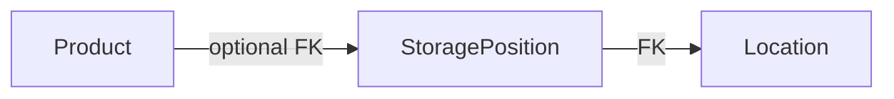

# Piano FASE 3: Prodotti collegati a Location / Position

## Contesto attuale

- `[Product](d:\source\housekeep\lib\domain\entities\product.dart)`: nessun riferimento a posizione.
- `[ProductHiveModel](d:\source\housekeep\lib\data\local\models\product_hive_model.dart)`: `typeId: 0`, `@HiveField` 0–6 — **aggiungere solo nuovi field in coda** (es. field 7) per non rompere la mappa esistente.
- `[ProductRepository](d:\source\housekeep\lib\domain\repositories\product_repository.dart)`: `getAll`, `getById`, `save`, `delete`.
- `[LocationRepository](d:\source\housekeep\lib\domain\repositories\location_repository.dart)`: gerarchia già pronta; commento FASE 3 già presente.
- Shell: `[HomeShellScreen](d:\source\housekeep\lib\presentation\views\screens\home_shell_screen.dart)` con `IndexedStack` (Inventario | Luoghi).

**Scelta modello relazione:** un solo FK `**positionId` opzionale** su `Product`. La **Location** si deriva da `StoragePosition.locationId` (lookup su gerarchia già persistita). Evita stati incoerenti (prodotto che punta a una Position di un’altra Location). Se serve “solo stanza senza mobiletto”, si può introdurre in FASE 3+ una **Position “Generica”** per location o un flag dedicato; non è nel minimo indispensabile.

---

## 1. Domain layer

### 1.1 `Product`

- Aggiungere `String? positionId` e `copyWith` con `clearPositionId` (pattern come date opzionali).
- **Nessuna lista inversa** su `StoragePosition` nel dominio (non serializzata): la relazione “molti prodotti → una position” resta query lato repository.

### 1.2 Validatori

- In `[product_validators.dart](d:\source\housekeep\lib\utils\product_validators.dart)` (o helper dedicato): se `positionId != null`, opzionale verifica esistenza — tipicamente delegata al repository al `save` per messaggio IT coerente (`ProductException`).

### 1.3 Repository astratto `ProductRepository`

Estendere l’interfaccia (tutto su `Future` come oggi):

- `Future<List<Product>> getByPositionId(String positionId)`
- `Future<List<Product>> getByLocationId(String locationId)` — implementazione: filtra prodotti con `positionId` le cui position appartengono a quella location (serve accesso a mappa position→location: vedi data layer).
- `Future<void> clearPositionIdForProducts(Iterable<String> productIds)` oppure `Future<int> clearPositionIdsWherePositionIn(Iterable<String> positionIds)` per integrità a cancellazione.

**Nota su “PositionRepository”:** nel codice attuale non esiste; le position vivono in `LocationRepository`. Evitare un secondo repository duplicato: `**getProductsInPosition()`** va su `**ProductRepository.getByPositionId`**. Se si desidera API “di dominio” più espressiva, si può aggiungere un **facade** sottile (es. `InventoryReadModel`) che compone `ProductRepository` + `LocationRepository` solo per UI/dashboard — opzionale.

---

## 2. Data layer

### 2.1 Hive `ProductHiveModel`

- `@HiveField(7) String? positionId` (o `int?` se preferite ID numerici — oggi gli ID sono stringhe UUID).
- Rigenerare `product_hive_model.g.dart` con `build_runner`.

### 2.2 Migrazione / compatibilità dati FASE 1–2

- **Aggiunta field in coda:** per record vecchi senza field 7, Hive restituisce `null` per quel campo (comportamento atteso con adapter codegen aggiornato).
- **Box `products`:** nessun cambio nome box; stesso `typeId: 0`.
- **Test obbligatorio:** aprire box popolato con modello “vecchio” (solo field 0–6) in temp dir, verificare lettura → `positionId == null`, poi `save` e round-trip.
- Opzionale: costante `kHiveSchemaVersion` in `[hive_service.dart](d:\source\housekeep\lib\data\local\hive_service.dart)` solo documentazione; **nessuna migrazione manuale** se l’append field basta.

### 2.3 `ProductMapper`

- Mappare `positionId` in `toDomain` / `toHive`.

### 2.4 `LocalProductRepository`

- Implementare i nuovi metodi con **una sola scansione** del box dove possibile (`values.where`).
- Per `getByLocationId`: caricare **tutte** le position della location senza N+1 su Hive — approccio consigliato:
  - leggere `positionsBox` (o delegare a `LocationRepository.getLocationWithPositions` se si inietta dipendenza), costruire `Set<String> positionIdsForLocation`;
  - una passata su `_box.values` filtrando `product.positionId` ∈ set.
- Alternativa più pulita a lungo termine: metodo interno `loadProductsWithPositionSet(Set<String> ids)` per riuso da dashboard.

### 2.5 Integrità referenziale (delete Location / Position)

| Evento                                      | Comportamento raccomandato                                                                                                                           |
| ------------------------------------------- | ---------------------------------------------------------------------------------------------------------------------------------------------------- |
| `deletePosition(id)`                        | **Svitare** i prodotti: `clearPositionIds` dove `positionId == id` (batch), poi delete position (ordine: prima prodotti, poi position).              |
| `deleteLocation(id)` (già cascade position) | Prima raccogliere tutti i `positionId` figli, **clear** prodotti che puntano a uno di essi, poi logica cascade esistente su box positions/locations. |

Implementazione: estendere `[LocalLocationRepository](d:\source\housekeep\lib\data\local\repositories\local_location_repository.dart)` con dipendenza da `**ProductRepository`** (o da callback `Future<void> Function(Iterable<String> positionIds)` per ridurre accoppiamento) — valutare DI in `[app_providers.dart](d:\source\housekeep\lib\core\di\app_providers.dart)`: `LocalLocationRepository(..., productRepository)`.

Validazione su `save(Product)`: se `positionId` non nullo e position non esiste → `ProductException` messaggio IT (stesso stile FASE 2 su save position).

---

## 3. ViewModel layer

### 3.1 `ProductViewModel`

- `createProduct` / `updateProduct` già ricevono `Product`: aggiornare i call site nel form per includere `positionId`.
- `loadProducts`: invariato; opzionale parametro `locationId` / filtro nome — meglio **stato locale di filtro** in VM (`String? _filterLocationId`, `String? _searchQuery`) che riapplica su lista già caricata o richiama repository se si spostano filtri nel repo.

### 3.2 Filtro per Location (lista inventario)

- Opzione A: `ProductViewModel.setLocationFilter(String? locationId)` + lista derivata `filteredProducts`.
- Opzione B: `ProductRepository.getByLocationId` chiamato quando il filtro è attivo (meno dati in memoria se cataloghi enormi; per inventario domestico A basta).

### 3.3 Dashboard / inventario per stanza

- `**LocationInventoryViewModel`** (o metodi su `LocationViewModel`): dopo `loadHierarchy()`, arricchire con prodotti:
  - una chiamata `productRepository.getAll()` + join in memoria con mappa `positionId → (locationId, nomeLocation, nomePosition)` costruita da `items` (gerarchia già in VM/repo) — **O(P+L)** senza N+1 Hive.
- Esporre modello read-only es. `List<LocationInventoryRow>`: `location`, `List<PositionWithProducts>` con `StoragePosition` + `List<Product>`.

**Caching:** tenere snapshot `Map<String, List<Product>>` by `positionId` invalidato su `notifyListeners` dopo mutazioni prodotto/location; oppure ricomputare solo quando cambia tab dashboard (semplice).

---

## 4. UI layer

### 4.1 `ProductFormScreen`

- **Dropdown a due livelli** (consigliato): prima `Location` (opzionale “Nessuna”), poi `Position` filtrata per location selezionata; oppure un solo dropdown flat “Location / Position” con etichette composite.
- Sincronizzazione: leggere `LocationViewModel.items` (o `context.read` + `loadHierarchy` se vuoto).
- Salvataggio: `positionId` null se “nessuna posizione”.

### 4.2 `ProductCard` / dettaglio

- Mostrare sottotitolo o chip: “Luogo: … · Posizione: …” se risolvibili da lookup (passare `String? locationLabel, positionLabel` dal parent dopo join, oppure piccolo `ProductDisplayInfo` calcolato nel list screen).

### 4.3 `LocationInventoryScreen` (nuova)

- Per ogni `Location`: `ExpansionTile` o sezioni con sotto ogni `Position` una lista di `ProductCard` compatta (o `ListTile`).
- Stato vuoto: messaggi coerenti con FASE 2.
- Entry: **terza destinazione** nella shell (“Riepilogo” / “Per stanza”) oppure **tap su location** in `[LocationListScreen](d:\source\housekeep\lib\presentation\views\screens\location_list_screen.dart)` → `Navigator.push` verso `LocationInventoryScreen(locationId: …)` (deep link “soft” dentro app).

### 4.4 Dashboard view

- Se distinta da `LocationInventoryScreen`: stessa sorgente dati; dashboard può essere **riepilogo numerico** (conteggi per location) + tap → schermata dettaglio. Per MVP: una sola schermata con conteggi in header e lista espandibile.

### 4.5 Flusso UX linking (riepilogo)

1. Utente crea/modifica prodotto → seleziona Location → Position (o nessuna).
2. Lista inventario mostra luogo/posizione sulla card.
3. Da Luoghi → tap location → inventario filtrato per quella stanza.
4. Eliminazione posizione: prodotto resta in lista senza posizione (o messaggio SnackBar “Rimosso dalla dispensa”).

---

## 5. Navigation

- `[app_routes.dart](d:\source\housekeep\lib\core\navigation\app_routes.dart)`: costanti `locationInventory`, argomenti `locationId`.
- `[HomeShellScreen](d:\source\housekeep\lib\presentation\views\screens\home_shell_screen.dart)`: aggiungere voce NavigationBar/Rail (es. “Riepilogo”) **oppure** solo route annidata da `LocationListScreen` per limitare a 2 tab (decisione prodotto: **3 tab** è più scopribile per “dashboard”).
- **Deep linking URL** (web): se/un quando si introduce `go_router`, stesso path `/locations/:id/inventory`; con `MaterialPageRoute` basta `onGenerateRoute` + `settings.arguments`.

---

## 6. Query e performance

- **N+1:** evitare `getById` per ogni prodotto; usare `getAll` + mappe in memoria O(1) lookup, oppure una sola lettura box products + una sola lettura positions/locations per costruire indici.
- **Indici Hive:** non obbligatori per volume domestico; se in futuro >10k righe, valutare **box secondario** `productByPosition` (duplicazione controllata) — fuori scope MVP.
- **Lista 1000 prodotti:** test performance esistente in `[test/performance/product_list_scroll_test.dart](d:\source\housekeep\test\performance\product_list_scroll_test.dart)` — dopo FASE 3, estendere con `positionId` popolato per misurare stesso budget; nessun `pumpAndSettle` infinito.

---

## 7. Testing

- **Domain/mapper:** round-trip `Product` con/senza `positionId`.
- **Data:** `LocalProductRepository` filtri; test integrità: dopo `deletePosition`, prodotti con quel `positionId` hanno `null`.
- **Data:** migrazione lettura record senza field 7.
- **Widget:** form con dropdown (mock `LocationViewModel` + `ProductViewModel`).
- **Widget:** `LocationInventoryScreen` con provider mock.

---

## 8. Ordine di implementazione suggerito

1. Domain `Product` + validatori opzionali.
2. Hive model + mapper + test migrazione lettura.
3. Estendere `ProductRepository` / `LocalProductRepository` (query + clear FK).
4. Collegare `LocalLocationRepository` delete a clear prodotti.
5. `ProductFormScreen` + card/dettaglio con label luogo/posizione.
6. `LocationInventoryScreen` + VM/dashboard + navigazione shell o push da lista luoghi.
7. `flutter analyze` / `flutter test` / smoke manuale.

