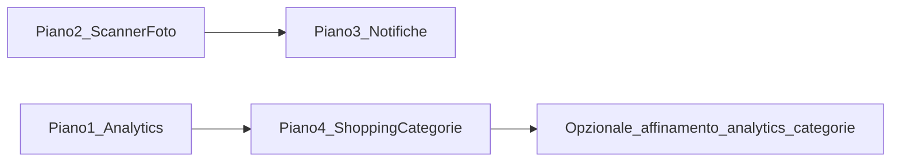

# FASE 4 — Quattro piani sequenziali (Housekeep)

Contesto attuale: `[AppFactory](d:\source\housekeep\lib\core\di\app_providers.dart)`, `[HiveService](d:\source\housekeep\lib\data\local\hive_service.dart)`, repository `Product`/`Location`, shell a 3 tab in `[home_shell_screen.dart](d:\source\housekeep\lib\presentation\views\screens\home_shell_screen.dart)`. Le entità vivono in `[lib/domain/entities/](d:\source\housekeep\lib\domain\entities)` (non `domain/models`). I Hive model sono in `[lib/data/local/models/](d:\source\housekeep\lib\data\local\models)` con `@HiveField` solo in coda per migrazioni.

---

## Piano 1 — Analytics dashboard, grafici, filtri periodo, export PDF/CSV

### Obiettivo MVP

- KPI derivabili da **prodotti + posizioni + luoghi** già in DB: totale prodotti, in scadenza entro 7 giorni, scaduti negli ultimi 30 giorni (e percentuale “spreco” come rapporto scaduti/totale o come definito in dominio), **consumo medio mensile**: senza log di consumo reale, definire una **euristica documentata** (es. `max(0, quantitaTotale - quantitaRimasta)` nel periodo se si assume che rifletta consumo, oppure placeholder 0 con ADR “richiede eventi consumo in futuro”).
- **Pie chart**: distribuzione per **luogo** (derivata da `positionId` → `StoragePosition` → `Location`), non per categoria finché non esiste `categoryId` (Piano 4).
- **Bar chart “top 5”**: MVP = top 5 **prodotti per quantità rimasta** o per nome frequente; rinominare in UI come “Top 5 per quantità” per non promettere “categorie” prima del Piano 4.
- **Line chart trend 3 mesi**: senza serie storica, opzioni: (A) grafico da **snapshot giornaliero** nuovo box opzionale, (B) linea piatta da un solo punto, (C) nascondere fino a Piano 4+eventi — **scegliere una opzione** e documentarla in ADR.

### Dipendenze `pubspec.yaml`

- `fl_chart` (versione compatibile con SDK attuale; verificare su pub.dev)
- `pdf`, `printing` (export PDF)
- `share_plus` (condivisione file export)

### Domain

- `lib/domain/entities/analytics_metrics.dart` — campi allineati al prompt; documentare formule.
- `lib/domain/entities/chart_data_point.dart` — `label`, `value`, opzionale `groupKey`.
- `lib/domain/repositories/analytics_repository.dart` — metodi `getMetrics`, `getLocationDistribution`, `getTopProductsByQuantity`, `getConsumptionTrend` (o equivalente ridotto).
- Eccezioni opzionali: `lib/domain/exceptions/analytics_exception.dart`.

### Data

- `lib/data/local/repositories/local_analytics_repository.dart` — implementazione che usa **solo** `[ProductRepository](d:\source\housekeep\lib\domain\repositories\product_repository.dart)` + `[LocationRepository](d:\source\housekeep\lib\domain\repositories\location_repository.dart)` (iniettati), nessuna logica UI.
- Export CSV/PDF: servizio `lib/data/export/analytics_report_exporter.dart` (o sotto `core/`) che riceve DTO già calcolati dal ViewModel o dal repository.

### Presentation

- `lib/presentation/viewmodels/analytics_view_model.dart` — stato, filtri `DateTimeRange`, `locationId` opzionale, `loadAnalytics`, export.
- `lib/presentation/views/screens/analytics/analytics_dashboard_screen.dart` + `widgets/` (`metric_card.dart`, `pie_chart_widget.dart`, `bar_chart_widget.dart`, `line_chart_widget.dart`, `filter_controls.dart`, `export_actions.dart`).
- Estendere `[home_shell_screen.dart](d:\source\housekeep\lib\presentation\views\screens\home_shell_screen.dart)`: nuova tab **Analytics** (4ª destinazione) con `IndexedStack` aggiornato.

### DI

- Estendere `[AppDependencies](d:\source\housekeep\lib\core\di\app_providers.dart)` + `AppFactory.create` con `AnalyticsRepository` (istanza locale).
- `[app.dart](d:\source\housekeep\lib\app.dart)`: `ChangeNotifierProvider<AnalyticsViewModel>`.

### Test

- `test/domain/analytics_metrics_test.dart` — pure function su date (edge expiry).
- `test/data/local_analytics_repository_test.dart` — Hive path temporaneo + seed prodotti/luoghi.
- `test/presentation/analytics_view_model_test.dart` — mock repository.
- Widget smoke: `test/views/analytics/analytics_dashboard_screen_test.dart`.

### Snippet struttura repository

```dart
abstract class AnalyticsRepository {
  Future<AnalyticsMetrics> getMetrics({
    required DateTime start,
    required DateTime end,
    String? locationId,
  });

  Future<List<ChartDataPoint>> getProductDistributionByLocation();
  Future<List<ChartDataPoint>> getTopByQuantity({int limit = 5});
  Future<List<ChartDataPoint>> getConsumptionTrendMonths({required int months});
}
```

### Ordine commit consigliato

1. Dipendenze + entità + interfaccia repository.
2. Implementazione locale + test data.
3. ViewModel + schermata + tab shell.
4. Export PDF/CSV + test leggeri.

---

## Piano 2 — Barcode scanner + foto prodotto

### Obiettivo MVP

- **Scanner**: schermata fullscreen con pacchetto scelto (`mobile_scanner` è più mantenuto e cross-platform di molti wrapper legacy; allineare a requisito camera). Fallback: dialog inserimento manuale codice.
- **Cache barcode**: nuovo Hive type per `BarcodeProduct` (barcode, nome suggerito, contatori scan, ultimo uso). Box dedicato + adapter in coda ai typeId esistenti.
- **Lookup**: `BarcodeRepository.lookupBarcode` → match su cache; se assente aprire `[product_form_screen](d:\source\housekeep\lib\presentation\views\screens\product_form_screen.dart)` con campo barcode/nome precompilati (richiede campo opzionale `barcode`/`codice` su `Product` + migrazione Hive).
- **Foto**: `image_picker` + `image` per resize; `PhotoRepository` salva file sotto directory app (`path_provider` già presente), path relativo in Hive (`ProductPhoto` o lista id foto). Max N foto per prodotto (es. 5).
- Aggiornare **Product** entity + `ProductHiveModel` + mapper + `build_runner`.

### Dipendenze

- `mobile_scanner` (o `flutter_barcode_scanner_plus` se preferito — verificare compatibilità Web: su Web spesso serve fallback manuale).
- `image_picker`, `image`

### Permessi

- Android: `CAMERA`, storage scoped come da plugin.
- iOS: `NSCameraUsageDescription`, `NSPhotoLibraryUsageDescription` in `Info.plist`.

### Domain / Data

- `lib/domain/entities/barcode_cache_entry.dart` (nome allineato al dominio, non solo “BarcodeProduct” se confonde con Product).
- `lib/domain/entities/product_photo.dart`
- `lib/domain/repositories/barcode_repository.dart`, `photo_repository.dart`
- `lib/data/local/models/*_hive_model.dart` + `local_barcode_repository.dart`, `local_photo_repository.dart`
- `lib/core/services/photo_processing_service.dart` — resize/compress (pure dove possibile).

### Presentation

- `barcode_scanner_screen.dart`, `scan_result_sheet.dart`, widget overlay/torch.
- Estendere FAB su `[product_list_screen.dart](d:\source\housekeep\lib\presentation\views\screens\product_list_screen.dart)`: icona scanner → route fullscreen.
- `ProductPhotoViewModel` o integrazione in `ProductFormScreen` con `Listenable` mirato.

### Test

- Repository barcode/photo con directory temporanea.
- ViewModel scanner con mock.
- Widget test form con foto mock (`TestWidgetsFlutterBinding`).

### Nota Web

- Scanner camera può essere limitato: mostrare messaggio e input manuale.

---

## Piano 3 — Notifiche locali + schermata impostazioni

### Obiettivo MVP

- `flutter_local_notifications` + `timezone` per schedule.
- `permission_handler` per Android 13+ notifiche; iOS request.
- **Persistenza impostazioni**: `NotificationSettings` in Hive (box dedicato o `SharedPreferences` — Hive coerente col resto).
- **Scheduling**: alla modifica prodotto / all’avvio app, ricalcolare notifiche per scadenza (giorno prima) e opzionale digest giornaliero (conteggio scaduti). **Low stock**: usa `Product.isLowStock` se già presente in `[product.dart](d:\source\housekeep\lib\domain\entities\product.dart)`, altrimenti definire soglia in settings.
- **Azioni notifica** (open app, snooze): usare `payload` + `onDidReceiveNotificationResponse`; “Segna consumato” richiede aggiornamento quantità via `ProductRepository` dal callback (attenzione contesto `Navigator` — servizio top-level o callback registrato in `main`).

### File principali

- `lib/domain/entities/notification_settings.dart`, `notification_schedule.dart` (o solo ID schedulati lato plugin).
- `lib/domain/repositories/notification_repository.dart` — astrae plugin + storage settings.
- `lib/core/services/notification_service.dart` — `initialize`, `rescheduleAllForProducts`, `cancelForProduct`.
- `lib/presentation/viewmodels/notification_settings_view_model.dart`
- `lib/presentation/views/screens/settings/notification_settings_screen.dart`
- Entry **Impostazioni**: nuova route/tab o voce in `AppBar` (decisione UX: tab 5 vs drawer — minimo: icona ingranaggio su shell).

### Platform

- AndroidManifest: `POST_NOTIFICATIONS`, `SCHEDULE_EXACT_ALARM` se necessario per allarmi esatti.
- Init in `main.dart` dopo `WidgetsFlutterBinding.ensureInitialized`.

### Test

- Mock `FlutterLocalNotificationsPlugin` tramite wrapper iniettabile o `NotificationRepository` fake.
- Test unit scheduling (date fisse) senza plugin reale.

### Web

- Notifiche web limitate: documentare fallback (solo in-app reminder o disabilitare).

---

## Piano 4 — Lista spesa + categorie prodotti

### Obiettivo MVP

- **Categorie**: entità `ProductCategory` (Hive nuovo typeId), repository CRUD, seed categorie predefinite in `AppFactory` o prima apertura box.
- **Product**: aggiungere `categoryId` opzionale (Hive field in coda) + aggiornare form e filtri lista.
- **Shopping list**: entità `ShoppingList` + `ShoppingListItem` in Hive; `ShoppingListRepository.generateFromInventory` con regole: qty 0, low stock, scaduti ultimi 7 giorni (parametri).
- **UI**: tab **Shopping** nello shell; schermata storico; checkbox completamento; export testo/CSV/PDF riusando `pdf`/`share_plus` dal Piano 1.
- **Integrazione Analytics (opzionale in questo piano)**: aggiornare `LocalAnalyticsRepository` per grafici “per categoria” e filtro categoria se non fatto nel Piano 1.

### Domain / Data

- `lib/domain/entities/product_category.dart`, `shopping_list.dart`, `shopping_list_item.dart`
- `lib/domain/repositories/category_repository.dart`, `shopping_list_repository.dart`
- Hive models + `local_category_repository.dart`, `local_shopping_list_repository.dart`

### Presentation

- `category_management_screen.dart`, `category_selector` nel form prodotto.
- `shopping_list_screen.dart`, `shopping_history_screen.dart`, widget priorità.

### Test

- Repository: generazione lista con seed controllato.
- ViewModel: toggle completamento, rigenerazione lista.

### Migrazione FASE 3 → 4

- Script o logica in `HiveService.init`: nuovi adapter; per ogni `ProductHiveModel` esistente, nuovi field default null; categorie seed; nessuna perdita dati.

---

## Dipendenze e versioni

- Allineare **tutte** le versioni a `sdk: ^3.4.0` e risolvere con `flutter pub outdated` / `pub get`.
- Aggiungere `share_plus`, `pdf`, `printing`, `fl_chart`, `mobile_scanner`, `image_picker`, `image`, `flutter_local_notifications`, `timezone`, `permission_handler` in un solo bump o per piano per ridurre conflitti.

## Diagramma dipendenze tra piani




- Piano 2 non blocca Piano 3 tecnicamente; ordine consigliato: 1 → 2 → 3 → 4 (come richiesto).
- Affinare grafici “per categoria” dopo Piano 4.

## Testing e qualità trasversali

- Mantenere `mocktail` per ViewModel; hive temporaneo per integration test come in `[integration_test/app_test.dart](d:\source\housekeep\integration_test\app_test.dart)`.
- Dopo ogni piano: `flutter analyze` + `flutter test`.
- ADR nuovi per: scelta `mobile_scanner`, modello dati trend consumo, policy notifiche Web.

