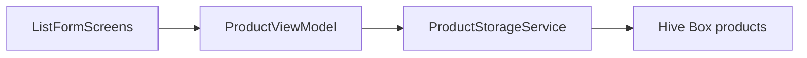

# Piano FASE 1 – Gestione prodotti (Flutter + Hive + Provider)

Contesto: la cartella `[d:\source\housekeep](d:\source\housekeep)` è attualmente senza `pubspec.yaml`; il piano assume creazione di un nuovo progetto Flutter nella root (o in una sottocartella `app/` se preferisci separare repo monorepo in seguito).

**Scelta persistenza:** **Hive** (più semplice di `sqlite_async` per modelli tipizzati e CRUD senza SQL; adatta a FASE 1). In FASE 2–3 puoi valutare migrazione solo se servono query relazionali complesse.

---

## 1. Setup progetto e configurazione iniziale

### 1.1 Creazione progetto

- Da terminale nella directory desiderata:
  - `flutter create --org com.example --platforms=android,ios,web .` (se la root è vuota) oppure `flutter create housekeep` e sposta i file.
- Verifica: `flutter --version` → Flutter **≥ 3.24**, Dart **≥ 3.4**.

### 1.2 `pubspec.yaml` – dipendenze essenziali

Aggiungi (versioni indicative compatibili con SDK recente; allineale con `flutter pub outdated` dopo il primo `pub get`):


| Pacchetto                              | Ruolo                                                                      |
| -------------------------------------- | -------------------------------------------------------------------------- |
| `provider`                             | State management / DI leggero                                              |
| `hive` + `hive_flutter`                | DB locale key-value tipizzata (mobile + web)                               |
| `path_provider`                        | Path directory applicazione (mobile; utile per init Hive su device)        |
| `path`                                 | Manipolazione path in modo cross-platform                                  |
| `intl`                                 | Formattazione date (locale)                                                |
| `uuid`                                 | Generazione `id` stringa univoca                                           |
| `flutter_localizations` + `intl` (SDK) | Localizzazione Material e date picker (opzionale ma consigliato per UI IT) |


**Dev dependencies:**


| Pacchetto              | Ruolo                                          |
| ---------------------- | ---------------------------------------------- |
| `hive_generator`       | Genera TypeAdapter da annotazioni              |
| `build_runner`         | Esegue code generation                         |
| `mockito` o `mocktail` | Mock nei test (opzionale ma utile per servizi) |


Esempio blocco `dependencies` (da incollare/adattare):

```yaml
dependencies:
  flutter:
    sdk: flutter
  flutter_localizations:
    sdk: flutter
  provider: ^6.1.2
  hive: ^2.2.3
  hive_flutter: ^1.1.0
  path_provider: ^2.1.4
  path: ^1.9.0
  intl: ^0.19.0
  uuid: ^4.5.1

dev_dependencies:
  flutter_test:
    sdk: flutter
  flutter_lints: ^5.0.0
  hive_generator: ^2.0.1
  build_runner: ^2.4.13
```

Nota: se `intl` entra in conflitto con la versione richiesta dal SDK Flutter, usa la versione suggerita dal messaggio di `pub get`.

### 1.3 Struttura cartelle `lib/`

```
lib/
  main.dart
  app.dart                    # MaterialApp, tema M3, MultiProvider
  models/
    product.dart              # Classe + annotazioni Hive
    product.g.dart            # generato
  services/
    product_storage_service.dart
    hive_init.dart            # init box + path (opzionale separato)
  viewmodels/
    product_view_model.dart
  views/
    screens/
      product_list_screen.dart
      product_form_screen.dart
    widgets/
      product_card.dart
      date_field.dart         # wrapper TextFormField + date picker
  utils/
    product_validators.dart   # validazione pura (testabile)
```

Allineamento MVVM: **View** (`views/`) osserva **ViewModel** (`viewmodels/`); il ViewModel usa **Service** (`services/`) e **Model** (`models/`).

### 1.4 Material 3

In `[lib/app.dart](lib/app.dart)` (o in `main.dart` se preferisci un solo file all’inizio):

- `ThemeData(useMaterial3: true, colorScheme: ColorScheme.fromSeed(seedColor: ...))`
- `localizationsDelegates` e `supportedLocales` se usi `flutter_localizations`.

### 1.5 Web (Flutter Web)

- **Nessun plugin nativo** richiesto oltre a quelli supportati: Hive su web usa storage appropriato tramite `hive_flutter`.
- File generati da `flutter create`: `[web/index.html](web/index.html)`, `[web/manifest.json](web/manifest.json)` — sufficienti per FASE 1.
- Opzionale: in `index.html` impostare `<meta name="viewport" ...>` (già presente nel template recente).
- Test manuale: `flutter run -d chrome`.

### 1.6 Android/iOS

- Android minSdk: verifica che sia compatibile con le dipendenze (template Flutter recente di solito ok).
- iOS: nessuna capability extra per storage locale in FASE 1.

---

## 2. Data model `Product`

### 2.1 Campi (mapping Dart)


| Campo richiesto   | Tipo Dart suggerito | Note                             |
| ----------------- | ------------------- | -------------------------------- |
| `id`              | `String`            | UUID v4                          |
| `nome`            | `String`            | obbligatorio, trim               |
| `dataAcquisto`    | `DateTime?`         | opzionale se non sempre nota     |
| `dataScadenza`    | `DateTime?`         |                                  |
| `dataApertura`    | `DateTime?`         |                                  |
| `quantitaTotale`  | `int`               | ≥ 1 se presente logica “rimasta” |
| `quantitaRimasta` | `int`               | 0 ≤ rimasta ≤ totale             |


Hive non serializza `DateTime` nativamente senza adapter custom: **approccio consigliato** — persistere date come `int?` (epoch ms) o `String?` (ISO8601) con getter/setter nella classe Hive, oppure usare un `TypeAdapter` manuale per `DateTime`. La soluzione più semplice in FASE 1: **campi privati `int?` in storage + proprietà `DateTime?` in Dart** nella stessa classe annotata, oppure solo `int?` esposti e conversione nel ViewModel. Per chiarezza: **una sola classe** `Product` con `@HiveType` e campi Hive-friendly (`int?` per date).

### 2.2 Hive adapter / code generation

- Annota la classe con `@HiveType(typeId: 0)` e ogni campo con `@HiveField(n)` (typeId univoco nel progetto).
- Esegui: `dart run build_runner build --delete-conflicting-outputs`
- Output: `[lib/models/product.g.dart](lib/models/product.g.dart)`
- Registra in init: `Hive.registerAdapter(ProductAdapter());`

### 2.3 Validazione

- **Non** solo in UI: estrai in `[lib/utils/product_validators.dart](lib/utils/product_validators.dart)` funzioni tipo `String? validateNome(String? value)`, `String? validateQuantita(int totale, int rimasta)` che restituiscono messaggio errore o `null` se ok.
- Il **ViewModel** o il **form** chiama questi validatori prima di `add`/`update`.
- Regole minime FASE 1: nome non vuoto; `quantitaRimasta` tra 0 e `quantitaTotale`; se `dataScadenza` e `dataAcquisto` entrambe presenti, opzionale vincolo scadenza ≥ acquisto.

---

## 3. Local storage service

### 3.1 File principale

`[lib/services/product_storage_service.dart](lib/services/product_storage_service.dart)`:

- Dipendenza da `Box<Product>` (o `LazyBox` se liste molto grandi — per inventario domestico `Box` va bene).
- Metodi: `Future<void> init()`, `List<Product> getAll()`, `Future<void> upsert(Product p)`, `Future<void> delete(String id)`, `Product? getById(String id)`.
- **Upsert:** `box.put(product.id, product)`.

### 3.2 Inizializzazione Hive

`[lib/main.dart](lib/main.dart)` o `[lib/services/hive_init.dart](lib/services/hive_init.dart)`:

- `WidgetsFlutterBinding.ensureInitialized()`
- `await Hive.initFlutter()` (hive_flutter)
- Su **mobile/desktop**: opzionale directory esplicita con `path_provider` + `path` se servisse; `initFlutter()` di solito basta.
- `Hive.registerAdapter(ProductAdapter())`
- `await Hive.openBox<Product>('products')`

### 3.3 Error handling

- Cattura eccezioni Hive (`HiveError`, errori IO) e rilancia come eccezioni di dominio leggere (es. `StorageException`) **o** restituisci `Result` type minimale (`Success`/`Failure`) — scegli uno stile e usalo anche nel ViewModel.
- Log in debug: `debugPrint` (mai loggare dati sensibili; qui non applicabile).

---

## 4. State management (Provider + MVVM)

### 4.1 `ProductViewModel`

`[lib/viewmodels/product_view_model.dart](lib/viewmodels/product_view_model.dart)`:

- `extends ChangeNotifier`
- Dipendenze: `ProductStorageService` (iniettato dal constructor per testabilità).
- Stato: `List<Product> products`, `bool isLoading`, `String? errorMessage`
- Metodi async:
  - `loadProducts()` → imposta loading, chiama service, aggiorna lista, `notifyListeners()`
  - `addProduct(Product p)` / `updateProduct(Product p)` → validazione → upsert → reload o update locale
  - `deleteProduct(String id)`
  - Getter sincrono: `get products` (lista corrente); opzionale `Product? getById` filtrando la lista o delegando al service

### 4.2 Wiring in `main` / `app`

- `MultiProvider` con:
  - `Provider<ProductStorageService>(create: (_) => ...)` oppure `Provider` + init async: per box async, pattern `**FutureBuilder` + `Provider` creato dopo `openBox`** oppure `**ChangeNotifierProvider` con ViewModel che fa `init` nel costruttore** (attenzione: il costruttore non può essere async — usa `Future.microtask(() => vm.loadProducts())` dopo il primo frame o un metodo `initialize()` chiamato da splash/list screen `initState`).

Diagramma flusso dati:




---

## 5. UI – Fase 1

### 5.1 Lista prodotti

`[lib/views/screens/product_list_screen.dart](lib/views/screens/product_list_screen.dart)`:

- `Consumer<ProductViewModel>` o `context.watch<ProductViewModel>()`
- `ListView.builder` con `ProductCard` per ogni item
- `FloatingActionButton` → navigazione a form (nuovo prodotto)
- Tap card → form modifica
- Swipe-to-delete o `IconButton` delete con `showDialog` conferma
- Stati: loading (`CircularProgressIndicator`), errore (`Text` + retry), lista vuota (empty state)

### 5.2 Form aggiungi/modifica

`[lib/views/screens/product_form_screen.dart](lib/views/screens/product_form_screen.dart)`:

- `GlobalKey<FormState>`, `TextFormField` per nome, campi numerici per quantità
- Widget riutilizzabile data (`[lib/views/widgets/date_field.dart](lib/views/widgets/date_field.dart)`): tap → `showDatePicker` (con `locale: const Locale('it', 'IT')` se abiliti localizations)
- Salvataggio: valida → crea `Product` con `uuid` → `viewModel.addProduct` / `updateProduct` → `Navigator.pop`

### 5.3 Card

`[lib/views/widgets/product_card.dart](lib/views/widgets/product_card.dart)`:

- `Card` M3 con titolo `nome`, sottotitoli con date formattate tramite `intl` `DateFormat.yMMMd('it_IT')` (o `dd/MM/yyyy`), badge quantità rimasta/totale

### 5.4 Formattazione date

- Centralizza in un piccolo helper (es. `formatDate(DateTime? d) => d == null ? '—' : DateFormat(...).format(d)`) in `[lib/utils/date_formatting.dart](lib/utils/date_formatting.dart)` per coerenza UI.

---

## 6. Testing

### 6.1 Unit test – model / validatori

- File: `[test/models/product_test.dart](test/models/product_test.dart)`, `[test/utils/product_validators_test.dart](test/utils/product_validators_test.dart)`
- Copri: conversioni date (se presenti), regole quantità, nome vuoto

### 6.2 Unit test – storage (persistenza)

- File: `[test/services/product_storage_service_test.dart](test/services/product_storage_service_test.dart)`
- In `setUp`: `Hive.init(await getTemporaryDirectory())` o directory temporanea da `path_provider`/`flutter_test` — per Hive puro spesso si usa `Directory.systemTemp` + `Hive.init(path)` in test (verifica documentazione Hive per test: inizializzazione senza `initFlutter` su VM test).
- Apri box in-memory o su temp path; test CRUD: insert, read, update, delete

### 6.3 Widget test

- File: `[test/views/product_list_screen_test.dart](test/views/product_list_screen_test.dart)`
- Avvolgi `MaterialApp` + `ChangeNotifierProvider` con `ProductViewModel` mock o fake service che restituisce lista fissa
- Verifica presenza testi / tap FAB (mock navigator oppure `tester` su chiavi)

### 6.4 Comandi

- `flutter test`
- `flutter analyze`

---

## 7. Ordine di implementazione consigliato (checklist)

1. `flutter create` + dipendenze + `build_runner` + adapter `Product`
2. Validatori + test validatori
3. `ProductStorageService` + init Hive + test storage
4. `ProductViewModel` + provider in `app.dart`
5. Schermate lista + form + widget card/date
6. Tema M3 e localizzazione IT
7. Widget test lista/form essenziali
8. Smoke test su Android emulator, iOS simulator, Chrome

---

## 8. Snippet starter (orientativi)

`**lib/models/product.dart` (scheletro):**

```dart
import 'package:hive/hive.dart';

part 'product.g.dart';

@HiveType(typeId: 0)
class Product extends HiveObject {
  @HiveField(0)
  String id;
  @HiveField(1)
  String nome;
  @HiveField(2)
  int? dataAcquistoMs;
  @HiveField(3)
  int? dataScadenzaMs;
  @HiveField(4)
  int? dataAperturaMs;
  @HiveField(5)
  int quantitaTotale;
  @HiveField(6)
  int quantitaRimasta;

  Product({
    required this.id,
    required this.nome,
    this.dataAcquistoMs,
    this.dataScadenzaMs,
    this.dataAperturaMs,
    required this.quantitaTotale,
    required this.quantitaRimasta,
  });

  DateTime? get dataAcquisto =>
      dataAcquistoMs == null ? null : DateTime.fromMillisecondsSinceEpoch(dataAcquistoMs!);
  // setter opzionali per comodità UI
}
```

`**lib/viewmodels/product_view_model.dart` (scheletro):**

```dart
class ProductViewModel extends ChangeNotifier {
  final ProductStorageService _storage;
  ProductViewModel(this._storage);

  List<Product> _products = [];
  bool isLoading = false;
  String? errorMessage;

  List<Product> get products => List.unmodifiable(_products);

  Future<void> loadProducts() async { /* ... */ }
  Future<void> addProduct(Product p) async { /* validate + upsert */ }
  Future<void> updateProduct(Product p) async { /* ... */ }
  Future<void> deleteProduct(String id) async { /* ... */ }
}
```

---

## 9. Rischi / note FASE 2–3

- **TypeId Hive:** riserva range (es. 0–5 prodotti, 10+ locations) per evitare collisioni quando aggiungi nuovi `@HiveType`.
- **Migrazione schema:** se cambi campi `Product`, prevedi `read` difensivo o versionamento box (Hive supporta migration callback).

Questo piano è autosufficiente per implementare la FASE 1 senza backend; dopo approvazione potrai passare all’implementazione file-per-file seguendo l’ordine della checklist.