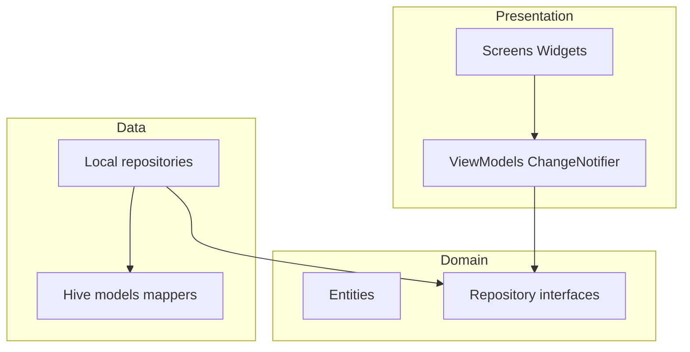
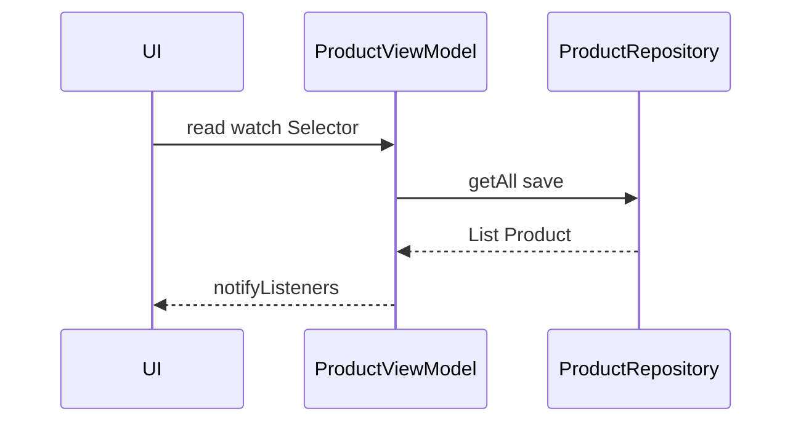

# Piano: documentazione mantenibile (housekeep)

## Contesto

- Progetto Flutter con layer già separati: `[lib/domain/](d:\source\housekeep\lib\domain)`, `[lib/data/](d:\source\housekeep\lib\data)`, `[lib/presentation/](d:\source\housekeep\lib\presentation)`, `[lib/core/](d:\source\housekeep\lib\core)`.
- `[README.md](d:\source\housekeep\README.md)` è ancora il template default Flutter.
- Non esiste cartella `docs/` dedicata.

---

## 1. Architecture documentation

### 1.1 Posizione e file

Creare cartella `**docs/architecture/**` con:


| File           | Contenuto                                                                                 |
| -------------- | ----------------------------------------------------------------------------------------- |
| `overview.md`  | Scopo app, stack (Flutter, Provider, Hive), vincoli (offline-first).                      |
| `layers.md`    | MVVM + repository: diagrammi Mermaid, regole di dipendenza (UI → VM → Repository → Hive). |
| `data-flow.md` | Flussi: caricamento inventario, salvataggio prodotto, gerarchia luoghi, export JSON.      |


### 1.2 Diagrammi (template Mermaid in `layers.md`)

**System design (layer):**




**State management (Provider):**




### 1.3 Regole da documentare in testo

- ViewModel non importa Hive o `Box`.
- Entità senza dipendenze Flutter.
- Nuovi campi Hive solo `@HiveField` in coda + `build_runner`.

---

## 2. Code documentation

### 2.1 README.md (root)

Sostituire il template con sezioni fisse:

1. **Titolo e descrizione** (1 paragrafo: inventario domestico, offline).
2. **Requisiti** (Flutter SDK minimo da `[pubspec.yaml](d:\source\housekeep\pubspec.yaml)` `environment.sdk`).
3. **Setup:** `git clone`, `flutter pub get`, `dart run build_runner build` (Hive).
4. **Esecuzione:** `flutter run`, piattaforme supportate.
5. **Test:** `flutter analyze`, `flutter test test/`, opzionale `integration_test`.
6. **Build release:** link a `[docs/developer/build.md](docs/developer/build.md)` o riassunto + link a `[scripts/](d:\source\housekeep\scripts)` e `[.github/workflows/](d:\source\housekeep\.github\workflows)`.
7. **Struttura repo:** tabella `lib/` (domain, data, presentation, core).
8. **Documentazione:** link a `docs/`.

### 2.2 Dart doc (`///`)

Priorità file pubblici / entry:

- `[lib/core/di/app_providers.dart](d:\source\housekeep\lib\core\di\app_providers.dart)` — `AppFactory`, `AppDependencies`.
- `[lib/data/local/hive_service.dart](d:\source\housekeep\lib\data\local\hive_service.dart)` — init, `dispose`, nomi box.
- Interfacce repository in `lib/domain/repositories/*.dart` — una riga per metodo critico.
- ViewModel principali — stato esposto e responsabilità.

Convenzione: primo paragrafo frase breve; `@param` / `@throws` solo dove non ovvio.

Comando: `dart doc` (opzionale in CI come job `documentation` non bloccante).

### 2.3 ADR — Architecture Decision Records

Cartella `**docs/adr/`**, un file per decisione: `NNNN-titolo-kebab-case.md`.

**Template ADR:**

```markdown
# NNNN. Titolo breve

- Stato: Proposto | Accettato | Deprecato
- Data: YYYY-MM-DD

## Contesto
## Decisione
## Conseguenze
## Alternative scartate
```

**ADR iniziali suggeriti (contenuto da riempire):**

- `0001-record-architecture-decisions.md` (perché usiamo ADR).
- `0002-local-storage-hive.md` (Hive vs altre opzioni).
- `0003-state-management-provider.md`.
- `0004-product-position-fk.md` (solo `positionId`, location derivata).

---

## 3. Developer guide

Cartella `**docs/developer/`**:


| File              | Contenuto                                                                                                                               |
| ----------------- | --------------------------------------------------------------------------------------------------------------------------------------- |
| `setup.md`        | IDE, estensioni, formattazione, `analysis_options.yaml`, branch strategy (se applicabile).                                              |
| `common-tasks.md` | **Aggiungere feature:** dove mettere UI, VM, repo; **Aggiungere modello:** entity → hive model → mapper → registrazione adapter → test. |
| `debugging.md`    | DevTools, `debugPrint` nei repository in debug, Hive path (Android/iOS/web), `HiveService.dispose` in test.                             |
| `testing.md`      | Piramide test; `test/domain`, `test/data`, `test/views`; mocktail; performance in `test/performance/`; goldens.                         |
| `build.md`        | Riferimento incrociato a script release, keystore, Firebase (da piano build già nel repo).                                              |


Opzionale: `**CONTRIBUTING.md`** in root con link a `docs/developer/setup.md` e convenzione commit/PR.

---

## 4. User documentation

### 4.1 Markdown (versionabile)

Cartella `**docs/user/`**:


| File          | Contenuto                                                                                               |
| ------------- | ------------------------------------------------------------------------------------------------------- |
| `overview.md` | Tab Inventario, Luoghi, Riepilogo; collegamento prodotto–posizione.                                     |
| `faq.md`      | Dati solo sul dispositivo, backup/export (quando disponibile in app), cosa succede eliminando un luogo. |


### 4.2 In-app help (implementazione futura guidata da doc)

- Schermata o sezione **“Aiuto”** nel menu (es. `AppBar` → `HelpScreen`) che carica testi da `**lib/presentation/views/help/help_topics.dart`** (costanti stringa) oppure da asset `assets/docs/user/*.md` con parser leggero (fase 2).
- **Tutorial primo avvio:** `SharedPreferences` flag `hasSeenOnboarding`; `showModalBottomSheet` o pagine `PageView` con 3–4 slide (allineate a `overview.md`).

Piano minimo: definire in `docs/user/overview.md` i testi che verranno copiati/adattati nell’UI per evitare divergenza.

---

## 5. Struttura directory finale (obiettivo)

```
docs/
  architecture/
    overview.md
    layers.md
    data-flow.md
  adr/
    README.md          # indice ADR + come proporne di nuovi
    0001-....md
  developer/
    setup.md
    common-tasks.md
    debugging.md
    testing.md
    build.md
  user/
    overview.md
    faq.md
README.md              # aggiornato
CONTRIBUTING.md        # opzionale
```

---

## 6. Ordine di lavoro consigliato

1. Creare `docs/architecture/*.md` con diagrammi Mermaid e link ai file reali.
2. Riscrivere `README.md` + aggiungere `docs/developer/*`.
3. Aggiungere 2–4 ADR seed + `docs/adr/README.md`.
4. Scrivere `docs/user/overview.md` e `faq.md`.
5. Incrementare `dart doc` su `AppFactory`, `HiveService`, repository.
6. (Opzionale) prima schermata Help statica che riusa titoli da `overview.md`.

