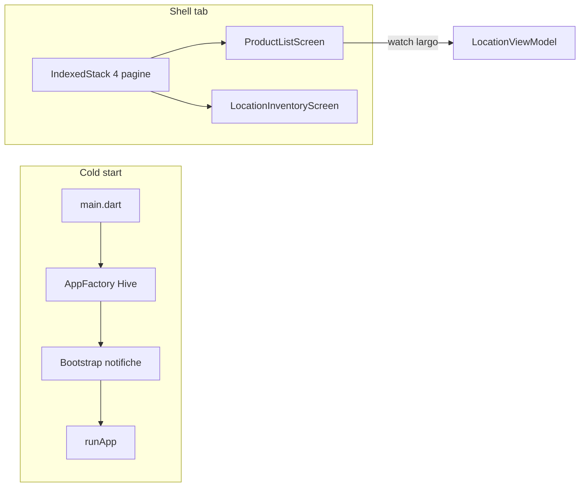

# Piano migliorie performance Housekeep

Contesto: l’analisi ha evidenziato quattro aree — **analytics N+1 su Hive consumi**, **rebuild di tab montate ma non visibili** (`IndexedStack`), **lavoro sincrono prima di `runApp`**, **ricostruzione sezioni Panoramica a ogni tasto**.

---

## Fase 1 — Analytics: una passata sui consumi (impatto alto)

**Problema:** in `[lib/data/local/repositories/local_analytics_repository.dart](lib/data/local/repositories/local_analytics_repository.dart)`, `getMetrics` chiama `await _consumptions.getByProductId(p.id)` per ogni prodotto. In `[local_consumption_repository.dart](lib/data/local/repositories/local_consumption_repository.dart)` ogni chiamata scorre **tutto** `_box.values` → costo ~O(N×M).

**Intervento:**

1. Estendere `[lib/domain/repositories/consumption_repository.dart](lib/domain/repositories/consumption_repository.dart)` con un metodo batch, ad es. `Future<Map<String, List<ConsumptionEntry>>> getAllGroupedByProductId()` (nome definitivo a piacere, documentato).
2. Implementarlo in `[LocalConsumptionRepository](lib/data/local/repositories/local_consumption_repository.dart)` con **un solo** loop su `_box.values`, raggruppando per `productId` (riusare `_toDomain` e ordinare le liste come oggi fa `getByProductId` se serve parità di comportamento).
3. Aggiornare `_NoOpConsumptionRepository` in `[app_providers.dart](lib/core/di/app_providers.dart)`, duplicato in `[local_analytics_repository.dart](lib/data/local/repositories/local_analytics_repository.dart)`, `[product_view_model.dart](lib/presentation/viewmodels/product_view_model.dart)` (stesso pattern esistente per nuovi metodi).
4. In `getMetrics`, sostituire il loop con lettura batch e lookup `map[p.id] ?? const []` per `ConsumptionCalculator.compute`.

**Test:** unit test mirato su `LocalAnalyticsRepository.getMetrics` con mock/fake consumi (o box in-memory) che verifichi che metriche chiave (es. `almostEmptyCount`, `avgDailySum`) restino coerenti con la versione precedente su un piccolo dataset.

---

## Fase 2 — UI: meno `watch` su tab sempre montate (impatto medio-alto)

**Contesto:** `[home_shell_screen.dart](lib/presentation/views/screens/home_shell_screen.dart)` usa `IndexedStack`: le quattro root restano nell’albero; un `context.watch` ampio su un `ChangeNotifier` che cambia spesso causa **build anche sulle tab non visibili**.

**Interventi mirati:**

1. `**[product_list_screen.dart](lib/presentation/views/screens/product_list_screen.dart)`** (~riga 455): dentro il `Selector` su `ProductViewModel`, sostituire `context.watch<LocationViewModel>()` con `Selector<LocationViewModel, …>` (o `context.select`) che esponga solo ciò che serve a `buildPlacementIndex` e al menu filtro — tipicamente `vm.items` (o una tupla `length` + hash/identità stabile se si vuole evitare rebuild inutili quando la lista è semanticamente uguale).
2. `**[analytics_dashboard_screen.dart](lib/presentation/views/screens/analytics/analytics_dashboard_screen.dart)`** (~riga 35): sostituire `context.watch<AnalyticsViewModel>()` con uno o più `Selector` su campi usati nel build (`isLoading`, `metrics`, `errorMessage`, liste grafici), oppure estrarre sottowidget con `Selector` dedicati per ridurre il costo per notifica.
3. **Opzionale nello stesso spirito:** `[analytics_filter_controls.dart](lib/presentation/views/screens/analytics/widgets/analytics_filter_controls.dart)` (doppio `watch`) — allineare a `select`/`Selector` dove possibile.

**Verifica:** `flutter test` sui widget test esistenti; smoke manuale cambio tab mentre si modificano luoghi/prodotti.

---

## Fase 3 — Cold start, load analytics parallelo, debounce Panoramica (impatto medio)

### 3a. Posticipare bootstrap notifiche

In `[main.dart](lib/main.dart)`, oggi prima di `runApp`: `getAll()` + `rescheduleAllForProducts`. **Spostare** questa coppia (dopo `initialize()` se necessario) in un callback **dopo il primo frame** (`WidgetsBinding.instance.addPostFrameCallback` o microtask subito dopo `runApp`), così il primo frame non attende il reschedule. Gestire errori come oggi (log, no crash).

Nota: `ProductViewModel.loadProducts` già chiama `reschedule` in background — valutare in implementazione se **deduplicare** (evitare doppio reschedule ravvicinato) senza cambiare comportamento notifiche; se troppo invasivo, limitarsi al defer da `main` e documentare il doppio percorso.

### 3b. `loadAnalytics` parallelo

In `[analytics_view_model.dart](lib/presentation/viewmodels/analytics_view_model.dart)`, le chiamate a `_repository` in `loadAnalytics` sono indipendenti dopo `getMetrics` (o anche includendo `getMetrics` se le altre non dipendono da esso). Raggruppare in `Future.wait` dove le dipendenze lo consentono, mantenendo gestione errori unificata (`try/catch` come oggi).

### 3c. Debounce ricerca Panoramica

In `[location_inventory_view_model.dart](lib/presentation/viewmodels/location_inventory_view_model.dart)`, `setSearchQuery` oggi ricalcola `_rebuildSections` + `notifyListeners` a ogni carattere.

- Opzione A: `Timer` debounce (es. 250 ms) in ViewModel con `dispose`/cancel se il VM non ha ciclo di vita chiaro — attenzione a leak.
- Opzione B (preferibile per semplicità): debounce in `[location_inventory_screen.dart](lib/presentation/views/screens/location_inventory_screen.dart)` nello `State`: `TextField.onChanged` aggiorna solo testo locale / controller; dopo debounce chiama `inv.setSearchQuery`. La ViewModel può restare “immediata” per test unitari, oppure esporre `setSearchQueryImmediate` vs debounced — tenere una sola API pubblica per evitare confusione.

Aggiornare eventuali test widget che digitano nel campo ricerca (attesa `pump` + debounce).

---

## Ordine di esecuzione consigliato

1. Fase 1 (dati analytics) — massimo ROI su cataloghi grandi.
2. Fase 2 (Provider/Selector) — migliora reattività generale.
3. Fase 3 — polish avvio e input; profilare con DevTools dopo Fase 1–2 per confermare.

---

## Fuori scope (per ora)

- Lazy `ChangeNotifierProvider` per tab (refactor DI più ampio).  
- Sostituire `IndexedStack` con costruzione lazy dei tab (trade-off stato/scroll).  
- Unificare cache prodotti tra Panoramica e Inventario (architettura dati condivisa).

