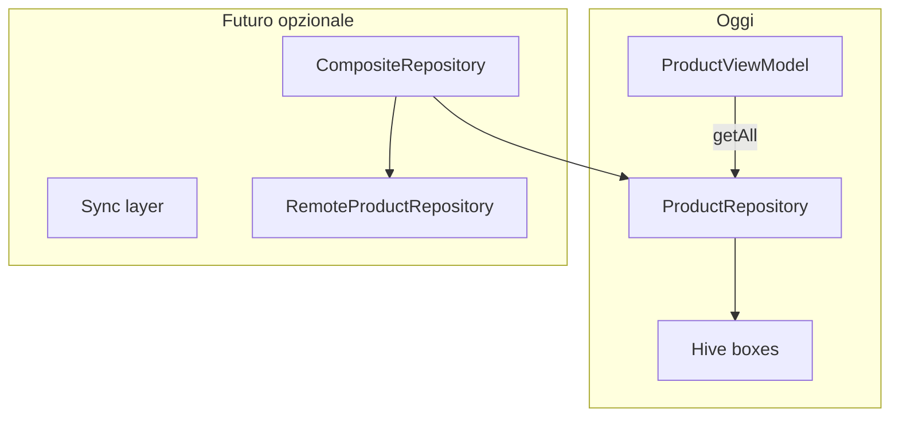

# Piano: ottimizzazioni pre-rilascio e roadmap post-MVP (housekeep)

## Contesto tecnico attuale (punti di aggancio)

- **Lista prodotti:** `[product_list_screen.dart](d:\source\housekeep\lib\presentation\views\screens\product_list_screen.dart)` usa già `ListView.builder` (buona base per liste lunghe).
- **Memoria / I/O:** `[ProductViewModel.loadProducts](d:\source\housekeep\lib\presentation\viewmodels\product_view_model.dart)` carica **tutti** i prodotti via `getAll()` e li tiene in `_products`; filtro luogo usa `displayedProducts` + set di `positionId` (OK per volume domestico, limite per 10k+ se ogni rebuild alloca liste grandi).
- **Hive:** `[HiveService](d:\source\housekeep\lib\data\local\hive_service.dart)` apre box all’avvio tramite DI; non c’è oggi un percorso documentato di `Hive.close()` / dispose all’uscita app (rilevante per test, hot restart aggressivo, backup).
- **Tema / i18n:** `[app.dart](d:\source\housekeep\lib\app.dart)` ha `locale: Locale('it','IT')` e deleghe Material; espansione i18n passerà da `flutter gen-l10n` o `intl` + ARB.

---

## 1. Profiling e identificazione dei colli di bottiglia

### 1.1 Strumenti e protocollo

- **Flutter DevTools — Performance:** registrare frame durante scroll della lista prodotti (1000 / 5000 / 10000 righe simulate); cercare jank (build/layout > 16 ms) e rebuild eccessivi del parent della lista.
- **CPU Profiler:** campionare durante `loadProducts`, `setLocationFilter`, costruzione indice placement (se presente in `[product_placement_helper.dart](d:\source\housekeep\lib\presentation\views\widgets\product_placement_helper.dart)` o equivalente): tempo in sort, mappe, `where`.
- **Memory DevTools:** snapshot dopo `loadProducts`; verificare duplicazioni (`List.unmodifiable`, copie per ogni `notifyListeners`, widget che tengono riferimenti a liste grandi).
- **Timeline / tracing:** `dart:developer` `Timeline` su operazioni repository (opzionale) per misurare ms su `getAll` vs paginazione futura.

### 1.2 Ipotesi di bottleneck da validare con numeri

- **Caricamento iniziale:** lettura intero box prodotti + sort O(n log n) su ogni `loadProducts`.
- **Filtro luogo:** chiamata a `[getLocationWithPositions](d:\source\housekeep\lib\domain\repositories\location_repository.dart)` ad ogni `setLocationFilter` (I/O Hive + allocazioni); con 10k prodotti il costo dominante resta spesso **lista prodotti in RAM**, non il filtro.
- **UI:** `ProductCard` troppo pesante (immagini future, molteplici `Text`/badge) o assenza di `itemExtent` / `cacheExtent` tuning.
- **Background:** oggi poche query periodiche; il rischio “battery” cresce con notifiche, sync polling o watch su box Hive senza debounce.

---

## 2. Lista di priorità ottimizzazioni (pre-MVP vs post-MVP)

### Alta priorità (basso sforzo, alto impatto per liste lunghe)

- **Evitare lavoro inutile su ogni frame:** `Selector` / `Consumer` più granulari (package `provider`) o spezzare widget lista in sotto-widget `const` dove possibile; ridurre `notifyListeners` globali quando cambia solo un campo.
- `**ListView.builder`:** impostare dove ha senso `itemExtent` se altezza riga fissa; regolare `cacheExtent` dopo profilazione.
- **Ricerca / filtro testuale (quando introdotto):** debounce 200–400 ms su `TextEditingController` + filtro su lista pre-indicizzata o su query repository (vedi sotto).

### Media priorità (10k prodotti)

- **Paginazione o “window” in ViewModel:** esporre `List<Product> visibleSlice` o integrare `PagedList` / cursore repository (`getPage(offset, limit)` + indice Hive secondario solo se necessario). Il piano dati attuale è box unico `products`: per paginazione serve o **ordinamento stabile con chiavi** o scansione segmentata (Hive non ha SQL; spesso si accetta `values` filtrati in memoria fino a soglia).
- **Indice opzionale Hive:** box ausiliario `productIdsByPosition` o struttura duplicata controllata — solo se il profilo mostra `getByLocationId` / filtri ripetuti troppo costosi (oggi già pensato per evitare N+1 in `[LocalProductRepository](d:\source\housekeep\lib\data\local\repositories\local_product_repository.dart)`).

### Memoria e Hive

- **Lifecycle:** documentare e opzionalmente implementare chiusura box in teardown controllato (test integration, `dispose` esplicito in `HiveService` chiamato da `AppFactory` / test harness), senza chiudere durante navigazione normale.
- **Lazy loading “logico”:** non caricare `LocationInventoryViewModel` finché non si apre il tab Riepilogo; invalidare cache inventario dopo CRUD (pattern già adombrato nel piano FASE 3).

### Batteria / background

- **Nessun polling** finché non c’è sync: evitare `Timer.periodic` su repository.
- **Notifiche future:** usare `WorkManager` / `BGTaskScheduler` con frequenza minima e batch; non ricalcolare scadenze su ogni resume senza debounce.

---

## 3. Feature post-MVP — note architetturali

| Area                        | Direzione architetturale                                                                                                                                                             |
| --------------------------- | ------------------------------------------------------------------------------------------------------------------------------------------------------------------------------------ |
| **Export/Import JSON-CSV**  | Nuovo servizio `InventoryExportImport` nel layer data o application che legge/scrive tramite **repository esistenti**; formato versionato (`schemaVersion` nel JSON) per migrazioni. |
| **Backup locale**           | File in `getApplicationDocumentsDirectory` + export atomico; opzione “condividi file” senza backend.                                                                                 |
| **Barcode / QR**            | Feature isolata: `camera` / `mobile_scanner`; adapter che mappa codice → `Product.id` o creazione guidata; **nessuna logica UI nel repository**.                                     |
| **Foto prodotto**           | Campo `imagePath` o `imageUri` su `Product`; storage file locale; thumbnail in lista (`Image.file` con cache); in futuro URL remoto se backend.                                      |
| **Notifiche scadenze**      | `flutter_local_notifications` + calcolo prossime scadenze da query repository (batch giornaliero); attenzione timezone e “solo data” già usata nel dominio.                          |
| **Categorie**               | Entità `Category` + FK opzionale su `Product` o tabella join; stesso pattern Hive typeId nuovo + box dedicato.                                                                       |
| **Statistiche consumo**     | Eventi append-only (`ConsumptionEvent`) o derivazione da storico quantità; meglio **nuovo box** che non appesantisce `getAll` prodotti.                                              |
| **Condivisione inventario** | Richiede backend: vedi sezione 5.                                                                                                                                                    |
| **Dark mode**               | Estendere `[app_theme.dart](d:\source\housekeep\lib\core\theme\app_theme.dart)` con `ThemeMode` da `SharedPreferences` + `MediaQuery.platformBrightness`.                            |
| **i18n**                    | Spostare stringhe in ARB; `MaterialApp.localizationsDelegates` già predisposti; aggiungere `l10n.yaml` e `AppLocalizations`.                                                         |

### “Plugin architecture” (realistico per Flutter)

- Invece di un vero plugin runtime dinamico: **feature module** come sotto-cartelle o package path (`packages/housekeep_export`, `packages/housekeep_scanner`) con interfacce in `lib/domain` o `lib/core/features/`.
- Contratto minimo: `abstract class Feature { String get id; void register(Registry r); }` che registra route opzionali e contributi al menu — utile solo se il numero di feature opzionali cresce molto.

---

## 4. API contract e logging / analytics (preparazione)

- **Contract backend (OpenAPI o documento condiviso):** risorse `Product`, `Location`, `Position`, `User`, `Share`; idempotenza su `PUT` con `ETag` o `version` campo; errori strutturati (`code`, `message`, `details`).
- **Repository remoto:** `RemoteProductRepository implements ProductRepository` (o adapter che decora `LocalProductRepository` con write-through / queue).
- **Logging:** wrapper sottile `AppLogger` (livelli debug/info/warn/error) con implementazione `debugPrint` in dev e no-op o crash reporting in release; evitare PII nei log.
- **Analytics:** interfaccia `Analytics.logEvent(name, params)` implementata con Firebase Analytics / Plausible solo dopo policy privacy.

---

## 5. Migrazione local-only → backend + sync

### Fasi suggerite

1. **Freeze schema locale:** UUID già usati come id facilitano merge; aggiungere `updatedAt` / `syncVersion` su entità prima del backend (migrazione Hive field in coda come FASE 3).
2. **Dual-write opzionale:** salvataggio locale immediato + coda outbox (`pending_ops` box) per upload quando online.
3. **Pull incrementale:** `since=timestamp` o cursor; reconciliazione: last-write-wins (semplice) o merge per campo (complesso).
4. **Auth:** OAuth / token in `flutter_secure_storage`; refresh token; nessun segreto in Hive in chiaro.
5. **Conflitti:** per inventario domestico spesso basta LWW + notifica “modificato sul cloud”; per condivisione multi-utente servono regole più rigide.

### Cosa non rompere

- Mantenere **repository di dominio** come frontiera: la UI continua a parlare con `ProductRepository`; sotto si scambia implementazione `Local` / `Remote` / `Synced`.

---

## 6. Ordine di lavoro consigliato (dopo rilascio MVP)

1. Profilare lista 1k / 5k / 10k (test seed + scroll) e documentare numeri baseline.
2. Ridurre rebuild e valutare paginazione o lazy load ViewModel se necessario.
3. Introdurre `updatedAt` + strategia export JSON versionato (base per backup e futuro sync).
4. Solo dopo: notifiche, scanner, foto (permessi store / camera per store).
5. i18n e tema quando la superficie stringhe è stabile.

