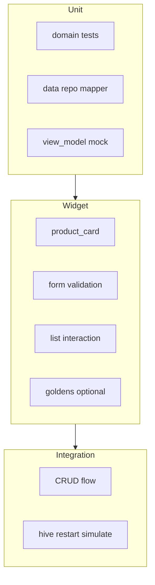

# Piano: test completi FASE 1 (housekeep)

**Contesto:** esistono già `[test/domain/](d:\source\housekeep\test\domain)`, `[test/data/](d:\source\housekeep\test\data)`, `[test/presentation/product_view_model_test.dart](d:\source\housekeep\test\presentation\product_view_model_test.dart)`, widget test in `[test/views/](d:\source\housekeep\test\views)`. Non c’è cartella `[integration_test/](d:\source\housekeep\integration_test)`. Dipendenze: `[mocktail](d:\source\housekeep\pubspec.yaml)` già presente.

---

## 1. Unit tests

### 1.1 Model `Product` e validazione


| File                                                                                                       | Contenuto aggiuntivo                                                                                                                                                      |
| ---------------------------------------------------------------------------------------------------------- | ------------------------------------------------------------------------------------------------------------------------------------------------------------------------- |
| `[test/domain/product_test.dart](d:\source\housekeep\test\domain\product_test.dart)`                       | Casi limite `daysUntilExpiry` (oggi, domani, stesso giorno mese diverso); `isExpired` con scadenza oggi/futuro; `copyWith` con date `DateTime` a ore diverse (solo data). |
| `[test/domain/product_validators_test.dart](d:\source\housekeep\test\domain\product_validators_test.dart)` | Già copre regole base; aggiungere `validateProductOrThrow` (se usato), messaggi in italiano coerenti, edge case quantità uguali.                                          |


**Nota:** la “validazione campi” di business è in `[lib/utils/product_validators.dart](d:\source\housekeep\lib\utils\product_validators.dart)` (non sulla classe `Product`); i test restano in `product_validators_test.dart`.

### 1.2 Repository (CRUD con mock)


| File                                                                                                               | Scopo                                                                                                                                                                                                                                                                                                                                                                                                      |
| ------------------------------------------------------------------------------------------------------------------ | ---------------------------------------------------------------------------------------------------------------------------------------------------------------------------------------------------------------------------------------------------------------------------------------------------------------------------------------------------------------------------------------------------------- |
| `[test/data/local_product_repository_test.dart](d:\source\housekeep\test\data\local_product_repository_test.dart)` | Già CRUD su Hive reale in temp dir. **Aggiungere** `[test/data/product_repository_contract_test.dart](d:\source\housekeep\test\data\product_repository_contract_test.dart)` oppure estrarre helper `Future<void> runCrudContract(ProductRepository repo)` invocabile sia con `LocalProductRepository` sia con un `**FakeProductRepository`** in-memory (`Map<String, Product>`) per test veloci senza I/O. |


**Mock setup (mocktail):** per test che usano solo interfaccia:

```dart
class MockProductRepository extends Mock implements ProductRepository {}

setUpAll(() {
  registerFallbackValue(Product(id: 'x', nome: 'x', quantitaTotale: 1, quantitaRimasta: 1));
});
```

### 1.3 ViewModel


| File                                                                                                                   | Estensioni                                                                                                                                                                                           |
| ---------------------------------------------------------------------------------------------------------------------- | ---------------------------------------------------------------------------------------------------------------------------------------------------------------------------------------------------- |
| `[test/presentation/product_view_model_test.dart](d:\source\housekeep\test\presentation\product_view_model_test.dart)` | `updateProduct` successo/errore; `deleteProduct` successo/errore; `loadProducts` con lista vuota; verifica `isLoading` true durante `loadProducts` (due `expect` attorno a microtask se necessario). |


---

## 2. Widget tests

### 2.1 File per categoria


| File                                                                                                       | Focus                                                                                                                                                                                                       |
| ---------------------------------------------------------------------------------------------------------- | ----------------------------------------------------------------------------------------------------------------------------------------------------------------------------------------------------------- |
| `[test/views/product_card_test.dart](d:\source\housekeep\test\views\product_card_test.dart)` (nuovo)       | Pump `ProductCard` con `Product` scaduto / urgente / OK / senza scadenza; `find.text` su nome, riga scadenza, `StatusBadge` labels; opzionale `find.byType(Dismissible)` assente sulla card (è nel parent). |
| `[test/views/product_form_screen_test.dart](d:\source\housekeep\test\views\product_form_screen_test.dart)` | Estendere: tap Salva con nome vuoto → messaggio validazione; compilazione minima e mock `save` → verifica chiamata (già pattern mock repo).                                                                 |
| `[test/views/product_list_screen_test.dart](d:\source\housekeep\test\views\product_list_screen_test.dart)` | Già lista, FAB, tap dettaglio; aggiungere **drag dismiss** con `tester.drag` + dialog (gestire `tester.pump` multipli) oppure testare solo `confirmDismiss` path con mock semplificato.                     |


**Mock setup widget:** `MaterialApp` + `MultiProvider` con `MockProductRepository` + `ProductViewModel` come in test esistenti; evitare `pumpAndSettle` con `CircularProgressIndicator` infinito (usare `pump(Duration)`).

### 2.2 Golden tests (opzionali ma nel piano)


| File                                                                                                                       | Contenuto                                                                                                                     |
| -------------------------------------------------------------------------------------------------------------------------- | ----------------------------------------------------------------------------------------------------------------------------- |
| `[test/views/goldens/product_card_golden_test.dart](d:\source\housekeep\test\views\goldens\product_card_golden_test.dart)` | `matchesGoldenFile('goldens/product_card_ok.png')` con `MaterialApp` + tema fisso; **stesso `surface` size** (es. `800x600`). |


**Prerequisiti:** font stabili (`ThemeData` + `fontFamily` bundled o `loadAppFonts` da `golden_toolkit` se si aggiunge dev_dependency). Su CI, golden spesso divergono per piattaforma: usare `flutter test --update-goldens` solo in locale e committare PNG per **una** piattaforma di riferimento (Linux CI o macOS), oppure `skip: !Platform.isLinux`.

**Dipendenza opzionale:** `[golden_toolkit](https://pub.dev/packages/golden_toolkit)` per `loadAppFonts()` e multi-scenario.

---

## 3. Integration tests

### 3.1 Setup

- Aggiungere cartella `[integration_test/](d:\source\housekeep\integration_test)` e in `[pubspec.yaml](d:\source\housekeep\pubspec.yaml)` dev_dependency `integration_test: { sdk: flutter }`.
- Comando: `flutter test integration_test/nome_test.dart` (o `flutter drive` per device reale se serve).

### 3.2 File proposti


| File                                                                                   | Flusso                                                                                                                                                                                                                                                                                                                                                                                                                                                                                         |
| -------------------------------------------------------------------------------------- | ---------------------------------------------------------------------------------------------------------------------------------------------------------------------------------------------------------------------------------------------------------------------------------------------------------------------------------------------------------------------------------------------------------------------------------------------------------------------------------------------- |
| `[integration_test/app_test.dart](d:\source\housekeep\integration_test\app_test.dart)` | `IntegrationTestWidgetsFlutterBinding.ensureInitialized()`; avvio app con `**Hive.init` su directory temporanea dedicata** (non `initFlutter` se si evita path_provider in test) oppure `path_provider` + `getTemporaryDirectory` su device; `AppFactory.create()` con override path se necessario (potrebbe richiedere **injection del path Hive** in `[HiveService](d:\source\housekeep\lib\data\local\hive_service.dart)` solo in test — valutare parametro opzionale `hivePath` per test). |
| Flusso UX                                                                              | FAB → form → nome + salva → lista contiene testo; tap card → dettaglio; edit → modifica nome → salva; delete da form o swipe con `tester.drag`.                                                                                                                                                                                                                                                                                                                                                |


### 3.3 Persistenza “riavvio app”

- **Strategia A:** stesso `integration_test`, due fasi nella stessa esecuzione: scrivi box, `Hive.close()`, `delete` box da disco **no** — riapri box con stesso path e verifica valori (simula restart senza kill process).
- **Strategia B:** due file test separati con path Hive condiviso sotto `integration_test/hive_data/` (fragile in parallelo).

Raccomandazione: **Strategia A** in un unico test con path univoco `Directory.systemTemp` + subfolder test.

**Nota:** oggi `[HiveService.init](d:\source\housekeep\lib\data\local\hive_service.dart)` usa `Hive.initFlutter()` senza path custom; per integration test affidabili su tutte le piattaforme può servire un **costruttore `HiveService({String? customPath})`** usato solo da harness di test (piccolo refactor).

---

## 4. Performance tests

### 4.1 Lista 1000 prodotti


| File                                                                                                                   | Approccio                                                                                                                                                                                                                                                                                                                                                                                           |
| ---------------------------------------------------------------------------------------------------------------------- | --------------------------------------------------------------------------------------------------------------------------------------------------------------------------------------------------------------------------------------------------------------------------------------------------------------------------------------------------------------------------------------------------- |
| `[test/performance/product_list_scroll_test.dart](d:\source\housekeep\test\performance\product_list_scroll_test.dart)` | Generare lista di 1000 `Product` (id univoci); `MockProductRepository` con `getAll` sincrono; pump `ProductListScreen` (o widget isolato `ListView.builder` con stesso `itemExtent` se si aggiunge per stabilità); `Stopwatch` attorno a `tester.pump()` + scroll `tester.fling` / `scrollUntilVisible`; **assert** tempo sotto soglia empirica (es. `< 2s` in debug, documentare che in CI varia). |


**ListView:** per performance migliori in produzione, valutare `ListView.builder` con `itemExtent` o `prototypeItem` (refactor UI fuori scope test — il test misura lo stato attuale).

### 4.2 Memory durante persistenza

- **Non** esiste API Dart portabile “memory usage” nei test unit/widget senza VM service.
- **Piano pratico:** documentare uso **Dart DevTools → Memory** durante scenario manuale o `flutter run --profile` + ripetute `save` in loop; opzione **integration_test** con `vm_service` avanzato (complessità alta, FASE 2).

Nel piano: obiettivo “verifica manuale + screenshot DevTools” e, se serve automazione, spike `test_driver` + Observatory (deprecato verso VM service).

---

## 5. Debugging e osservabilità

### 5.1 Hive “inspector”

- **Opzione leggera:** in debug, schermata nascosta o `debugPrint` che fa `box.toMap()` (solo build debug) — attenzione dati sensibili.
- **Opzione tool:** cercare pacchetti tipo `hive_flutter` + estensioni community; non c’è ufficiale “Hive Inspector” come Realm. Documentare **Hive Studio** desktop (legge file Hive su disco) + path del file su Android/iOS (difficile) vs web (IndexedDB).
- **Consiglio:** log strutturato in `[LocalProductRepository](d:\source\housekeep\lib\data\local\repositories\local_product_repository.dart)` dietro `assert(() { debugPrint(...); return true; }());` o `kDebugMode`.

### 5.2 DevTools

- **Flutter Inspector** per albero widget; **Performance** per jank su lista lunga; **Logging** per `debugPrint` / `dart:developer` `log`.

### 5.3 Error logging strategy

- Centralizzare messaggi utente nel ViewModel (già presente); per stack trace usare `FlutterError.onError` / `runZonedGuarded` in `[main.dart](d:\source\housekeep\lib\main.dart)` solo in debug, oppure pacchetto `talker` / `logger` (dev_dependency opzionale) con livelli `warning` per `ProductException`.

---

## 6. Coverage (obiettivo minimo 80%)

### 6.1 Comandi

```bash
flutter test --coverage
genhtml coverage/lcov.info -o coverage/html   # opzionale, richiede lcov
```

### 6.2 Esclusioni (`.yaml` o `lcov` remove)

- `lib/**/*.g.dart` (Hive generated)
- `lib/main.dart` (entry minimo, opzionale includere)

### 6.3 Gate CI

- Script che fallisce se `lcov` line coverage `< 80%` su `lib/` (escludendo generated). Tool possibili: `[coverage](https://pub.dev/packages/coverage)` + script Dart, o `very_good_coverage` in CI.

### 6.4 Target per modulo (indicativi)


| Modulo                         | Obiettivo                                                        |
| ------------------------------ | ---------------------------------------------------------------- |
| `lib/domain/`                  | 90%+                                                             |
| `lib/data/local/mappers/`      | 90%+                                                             |
| `lib/presentation/viewmodels/` | 85%+                                                             |
| `lib/presentation/views/`      | 70–80% (UI + golden riduce necessità line coverage su ogni ramo) |


---

## 7. Ordine di implementazione consigliato

1. Refactor opzionale `HiveService` / factory per path testabile (se si vogliono integration test persistenza seri).
2. Estendere unit test domain + ViewModel + fake repository contract.
3. Nuovi widget test `ProductCard` + estensioni form/lista.
4. Aggiungere `integration_test` + primo flusso CRUD.
5. Aggiungere `test/performance` con soglia documentata.
6. Golden (opzionale) con policy piattaforma.
7. Script coverage + README sezione “Testing” (solo se il team lo richiede; altrimenti commento in `analysis_options` o script `tool/coverage_check.dart`).




Questo piano è allineato alla clean architecture attuale (domain / data / presentation) e non richiede modifiche al file di piano UI già presente nel repo.