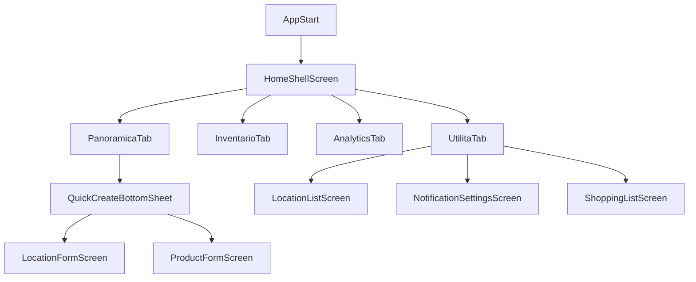

# Piano Consolidamento UI + Performance

## Obiettivo

Portare l’app a uno stato stabile e coerente dopo il refactor navigation: UX uniforme, flussi completi dalla Panoramica, test allineati alla nuova IA e miglioramenti performance con misurazioni ripetibili.

## Scope incluso

- IA definitiva a 4 tab e semantica tab pulita.
- Uniformità visuale/schemi layout tra schermate principali e secondarie.
- Consolidamento flussi operativi in Panoramica.
- Aggiornamento test widget/integration rispetto alla nuova navigazione.
- Ottimizzazioni performance UI state/render + riduzione carichi inutili.

## Architettura target (navigation)

## Interventi proposti

### 1) Navigation contract e cleanup indici tab

- Rimuovere alias compat non necessario (`tabLocations`) e riallineare onboarding/tour ai nuovi target tab.
- Esplicitare contratto di navigazione in un unico punto (`HomeShellTabController`) e usare solo costanti canoniche.
- Verificare che tutte le CTA cross-screen puntino a destinazioni valide nel nuovo modello.

File principali:

- [d:/source/housekeep/lib/presentation/viewmodels/home_shell_tab_controller.dart](d:/source/housekeep/lib/presentation/viewmodels/home_shell_tab_controller.dart)
- [d:/source/housekeep/lib/presentation/views/screens/home_shell_screen.dart](d:/source/housekeep/lib/presentation/views/screens/home_shell_screen.dart)
- [d:/source/housekeep/lib/presentation/views/screens/onboarding/onboarding_screen.dart](d:/source/housekeep/lib/presentation/views/screens/onboarding/onboarding_screen.dart)
- [d:/source/housekeep/lib/presentation/views/widgets/tour/tour_overlay.dart](d:/source/housekeep/lib/presentation/views/widgets/tour/tour_overlay.dart)

### 2) Uniformità UI cross-screen

- Standardizzare top bar (`StitchTopAppBar`) con regole: root tab senza back, schermate in push con back.
- Uniformare spacing verticale/orizzontale e safe area su schermate form/list/settings.
- Consolidare pattern visivi (cards azione, empty states, call-to-action primarie).

File principali:

- [d:/source/housekeep/lib/presentation/views/widgets/stitch_top_app_bar.dart](d:/source/housekeep/lib/presentation/views/widgets/stitch_top_app_bar.dart)
- [d:/source/housekeep/lib/presentation/views/screens/location_inventory_screen.dart](d:/source/housekeep/lib/presentation/views/screens/location_inventory_screen.dart)
- [d:/source/housekeep/lib/presentation/views/screens/location_list_screen.dart](d:/source/housekeep/lib/presentation/views/screens/location_list_screen.dart)
- [d:/source/housekeep/lib/presentation/views/screens/product_detail_screen.dart](d:/source/housekeep/lib/presentation/views/screens/product_detail_screen.dart)
- [d:/source/housekeep/lib/presentation/views/screens/settings/notification_settings_screen.dart](d:/source/housekeep/lib/presentation/views/screens/settings/notification_settings_screen.dart)
- [d:/source/housekeep/lib/presentation/views/screens/settings/onboarding_settings_screen.dart](d:/source/housekeep/lib/presentation/views/screens/settings/onboarding_settings_screen.dart)

### 3) Panoramica come hub operativo

- Mantenere FAB unico “+” come entrypoint primario.
- Ridurre duplicazioni CTA in-page (valutare rimozione card azioni globale se ridondante).
- Migliorare azioni contestuali per luogo (aggiungi prodotto con posizione pre-selezionata, fallback chiari se non ci sono posizioni).

File principali:

- [d:/source/housekeep/lib/presentation/views/screens/location_inventory_screen.dart](d:/source/housekeep/lib/presentation/views/screens/location_inventory_screen.dart)
- [d:/source/housekeep/lib/presentation/views/screens/product_form_screen.dart](d:/source/housekeep/lib/presentation/views/screens/product_form_screen.dart)
- [d:/source/housekeep/lib/presentation/views/screens/location_form_screen.dart](d:/source/housekeep/lib/presentation/views/screens/location_form_screen.dart)

### 4) Performance pass (UI + state)

- Ridurre rebuild non necessari nelle schermate dense:
  - introdurre selettori più granulari (`context.select` / `Selector`) su VM usate in liste.
  - isolare widget costosi in sottocomponenti const-friendly.
- Ottimizzare rendering list/expansion:
  - verificare uso keys stabili.
  - minimizzare lavoro in `itemBuilder` (precompute dove possibile).
- Evitare refresh ridondanti post-navigation:
  - centralizzare strategia `refreshAfterPop` per evitare doppi load sequenziali.
- Misurazione:
  - baseline e confronto con `flutter run --profile` e DevTools frame chart su Panoramica/Inventario.

File principali:

- [d:/source/housekeep/lib/presentation/views/screens/location_inventory_screen.dart](d:/source/housekeep/lib/presentation/views/screens/location_inventory_screen.dart)
- [d:/source/housekeep/lib/presentation/views/screens/product_list_screen.dart](d:/source/housekeep/lib/presentation/views/screens/product_list_screen.dart)
- [d:/source/housekeep/lib/presentation/viewmodels/location_inventory_view_model.dart](d:/source/housekeep/lib/presentation/viewmodels/location_inventory_view_model.dart)
- [d:/source/housekeep/lib/presentation/viewmodels/product_view_model.dart](d:/source/housekeep/lib/presentation/viewmodels/product_view_model.dart)

### 5) Test hardening e regressioni

- Aggiornare test widget che assumono vecchie tab (`Luoghi`) e vecchi percorsi di navigazione.
- Aggiungere test per:
  - FAB “+” in Panoramica e quick create menu.
  - creazione luogo/prodotto da Panoramica.
  - visibilità back button condizionale in Panoramica vs dettaglio luogo.
- Stabilizzare smoke test E2E sui flussi primari.

File principali:

- [d:/source/housekeep/test/views/location_list_screen_test.dart](d:/source/housekeep/test/views/location_list_screen_test.dart)
- [d:/source/housekeep/test/views/location_inventory_screen_test.dart](d:/source/housekeep/test/views/location_inventory_screen_test.dart)
- [d:/source/housekeep/test/views/product_list_screen_test.dart](d:/source/housekeep/test/views/product_list_screen_test.dart)
- [d:/source/housekeep/test/app_smoke_test.dart](d:/source/housekeep/test/app_smoke_test.dart)

## Criteri di accettazione

- Navigation a 4 tab coerente e senza alias legacy nel codice applicativo.
- Panoramica consente creazione luogo/prodotto senza uscire dal contesto.
- Top bar/layout uniformi nelle schermate core e settings.
- Test widget/smoke verdi sul nuovo flusso IA.
- Nessun peggioramento frame pacing nelle schermate principali; riduzione jank percepito su scroll/expand.

## Rischi e mitigazioni

- Rischio: regressioni su onboarding/tour per cambio costanti tab.
  - Mitigazione: test dedicati su step navigation + fallback assertivi.
- Rischio: ottimizzazioni premature senza metrica.
  - Mitigazione: baseline profile prima/dopo e interventi incrementali.

