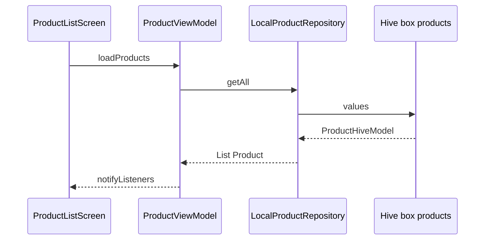

# Flussi dati principali

## 1. Avvio app e inventario

1. `main` → `AppFactory.create()` in [`app_providers.dart`](../../lib/core/di/app_providers.dart).
2. `HiveService.init()` registra adapter e apre i box.
3. `HousekeepApp` espone `ProductRepository`, `LocationRepository`, ViewModel.
4. `ProductListScreen` in `initState` chiama `ProductViewModel.loadProducts()` e `LocationViewModel.loadHierarchy()`.
5. `loadProducts` → `ProductRepository.getAll()` → lettura box `products`, ordinamento in memoria, aggiornamento stato UI.

## 2. Salvataggio prodotto

1. Form costruisce un `Product` (domain).
2. `ProductViewModel.createProduct` / `updateProduct` → validazione → `ProductRepository.save`.
3. `LocalProductRepository` valida `positionId` se presente, imposta `updatedAt`, scrive Hive.

## 3. Gerarchia luoghi

1. `LocationViewModel.loadHierarchy` → `getAllWithPositions`.
2. `LocalLocationRepository` legge box `locations` e `positions`, raggruppa per `locationId`, ordina.

## 4. Integrità a cancellazione

- `deletePosition`: `ProductRepository.clearPositionIdsForPositions` poi rimozione posizione.
- `deleteLocation`: raccolta id posizioni figlie, clear prodotti, cascade posizioni e location.

## 5. Export inventario (JSON)

`InventoryExportService` in [`lib/data/export/inventory_export.dart`](../../lib/data/export/inventory_export.dart) legge prodotti e gerarchia dai repository e produce un documento con `schemaVersion` (backup / futuro import).

## Riferimenti

- Repository prodotti: [`local_product_repository.dart`](../../lib/data/local/repositories/local_product_repository.dart)
- Repository luoghi: [`local_location_repository.dart`](../../lib/data/local/repositories/local_location_repository.dart)
