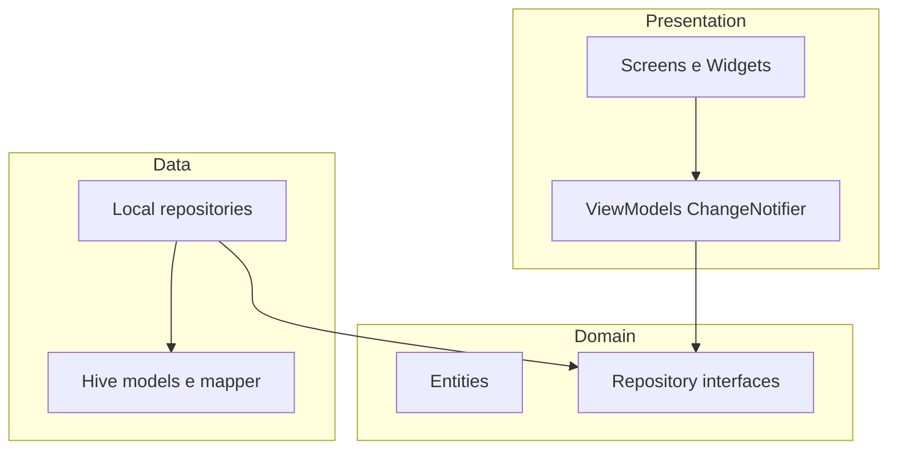
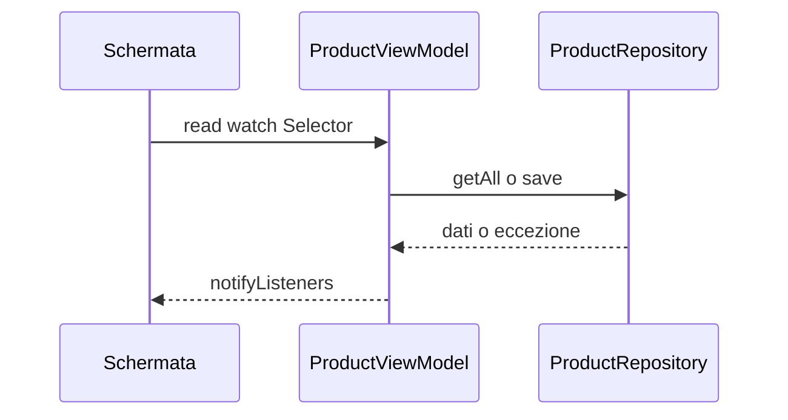

# Layer e dipendenze (MVVM + repository)

## Regole

1. **Presentation** (`lib/presentation/`) può dipendere da **domain** e Flutter; **non** importa Hive, `Box`, o modelli `*HiveModel`.
2. **Domain** (`lib/domain/`) è puro Dart: entità, eccezioni, **interfacce** repository. Nessuna dipendenza da Flutter o Hive.
3. **Data** (`lib/data/`) implementa le interfacce domain, usa Hive, mapper e DTO.
4. **ViewModel** espone stato alla UI e chiama solo **repository astratti** (tipi domain).

## Diagramma layer

## State management (Provider)

La root registra `Provider` per i repository e `ChangeNotifierProvider` per i ViewModel. Le schermate usano `context.read`, `context.watch` o `Selector` per limitare i rebuild.

## Hive e typeId

| typeId | Modello | Box |
|--------|---------|-----|
| 0 | `ProductHiveModel` | `products` |
| 1 | `LocationHiveModel` | `locations` |
| 2 | `PositionHiveModel` | `positions` |

Registrazione adapter in [`HiveService.init`](../../lib/data/local/hive_service.dart).

## File di riferimento

| Layer | Esempi |
|-------|--------|
| Domain | `lib/domain/entities/`, `lib/domain/repositories/` |
| Data | `lib/data/local/repositories/`, `lib/data/local/mappers/` |
| Presentation | `lib/presentation/views/`, `lib/presentation/viewmodels/` |
