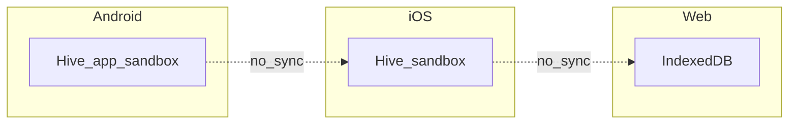

# Validazione end-to-end e pre-release

Questa cartella raccoglie **procedure manuali**, **matrici cross-platform** e **checklist** per validare Housekeep prima del rilascio (FASE 1–3).

## Premessa: storage isolato per piattaforma

Hive su Android, iOS e Web usa **directory diverse** (nessun sync cloud nel MVP). La validazione cross-platform confronta **comportamento e UI**, non l’uguaglianza del database tra dispositivi.

## Indice documenti

| File | Contenuto |
|------|-----------|
| [e2e-manual-scenario.md](e2e-manual-scenario.md) | Struttura luoghi, 50 prodotti, persistenza cold start |
| [cross-platform-validation.md](cross-platform-validation.md) | Android / iOS / Web: cosa ripetere e cosa confrontare |
| [edge-cases.md](edge-cases.md) | Cancellazioni, dataset grandi, date estreme — attesi dal codice |
| [ux-smoke.md](ux-smoke.md) | Navigazione, onboarding, messaggi di errore |
| [pre-release-checklist.md](pre-release-checklist.md) | Checklist unica pre-rilascio + automazione |

## Automazione nel repo

- Test integration: `flutter test integration_test/app_test.dart` (Hive su path temporaneo; persistenza dopo `close`).
- Carico lista: `flutter test test/performance/product_list_scroll_benchmark.dart test/performance/product_view_model_load_benchmark.dart test/performance/product_list_scale_benchmark.dart`.
- Seed Hive su disco (benchmark o ispezione): `dart run tool/seed_performance_dataset.dart [count] [outputDir]`
